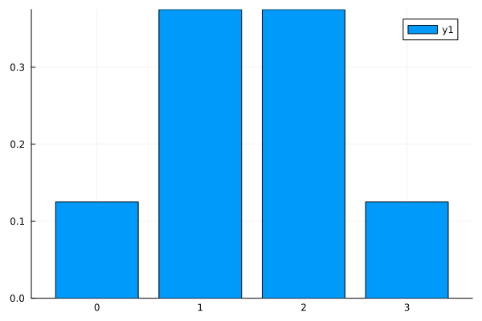
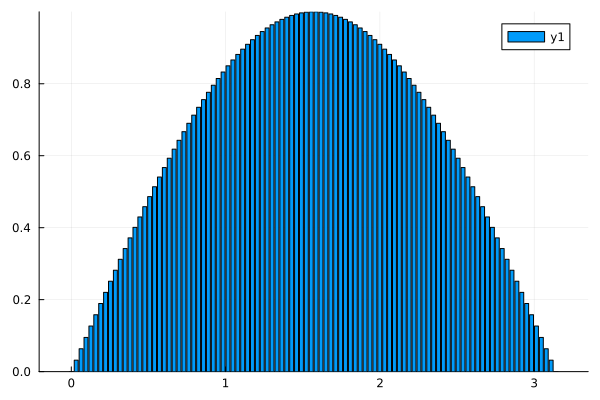
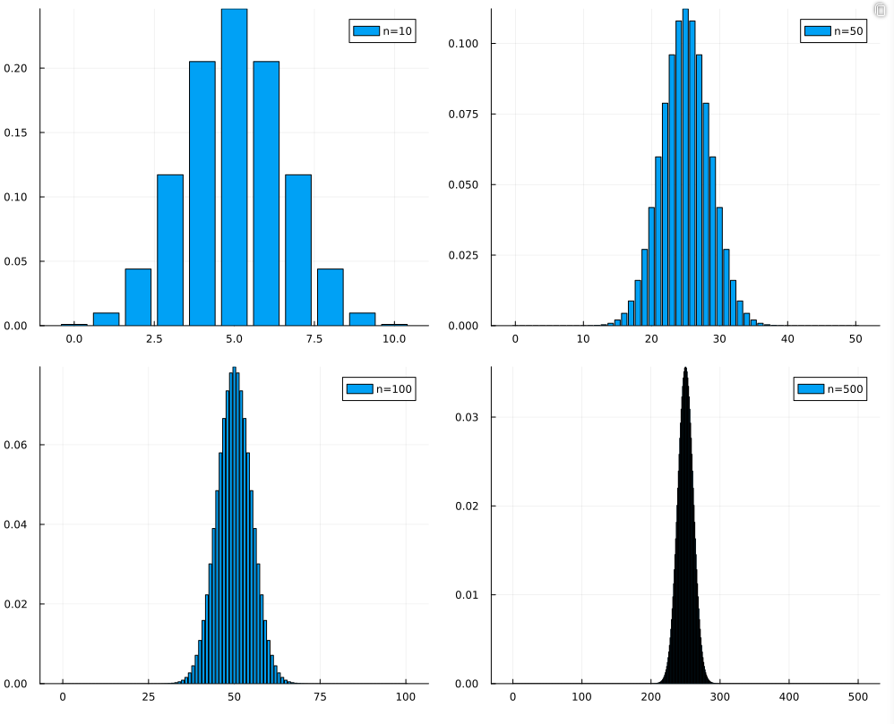

# 一维连续型随机变量

- [一维连续型随机变量](#一维连续型随机变量)
  - [介绍](#介绍)
  - [均匀分布](#均匀分布)
  - [指数分布](#指数分布)
  - [正态分布](#正态分布)
  - [补充: 用另一种形式推导 正态分布的概率密度函数](#补充-用另一种形式推导-正态分布的概率密度函数)

## 介绍

在前面的 一维离散型随机变量 中，要对 **离散型随机变量的分布** 进行分布，我们需要

1. 列出所有的事件
2. 列出所有事件的可能性

我们随便有一个表格来描述

| 事件k | 0 | 1 |2 | 3 |
|:--:|:--:|:--:|:--:|:--:|
|$p$| $p(0)$ | $p(1)$| $p(2)$ | $p(3)$|

我们通常用函数 $p(X=k)$ 来描述一个事件的概率
___
现在，我们从图像上看 离散型随机分布  
其中 x轴是事件取值，y轴是事件概率，有
$$
y = f(x)
$$
从图像上计算事件概率时，有
$$
\begin{aligned}
&p(k) = \frac{f(k)}{\sum f(x)}& \\
&\sum f(x) = 1&
\end{aligned}
$$

我们知道，连续性随机变量的分布中，事件的取值不再是单个的数字了，而是一个范围内的任意取值，从图像上看有  

这还是我们将0到3切分成100份后画出的图，而我们应该用积分的形式去看待图像

如果我们还是用 $p(X=k)$ 来描述一个事件的概率的话，有
$$
\begin{aligned}
&p(k) = \frac{f(k)dx}{\int_{start}^{end} f(x)dx}& \\
&\int_{start}^{end} f(x)dx = 1&
\end{aligned}
$$
但是，我们已经知道，在微积分中，这个 $f(x)dx$ 是无限小的，也就是说
$$
p(X = k) \to 0
$$

这样描述连续型随机变量的分布没有意义，于是，我们用这种方式来描述他的概率分布
$$
p(X \le k) = \int_{start}^{k} f(x)dx
$$

随机变量$x$分布在 $-\infin \to +\infin$ 上  
我们用 $f(x)$ 表示 $x$ 的概率，其实就是 $p(X = x)$ ，我们称之为 **概率密度函数**  
而 概率密度的函数的**累积** $p(X \le x)$ ，我们称之为 **概率分布函数**  
我也不知道这个翻译怎么来的，不能好好用 **密度** 和 **质量** 吗

## 均匀分布

我们能想到的最简单的 连续分布就是 连续分布

有概率密度函数 $f(x)$ 在 $[a, b]$ 上，我们已经知道
$$
\int_a^b f(x) = 1
$$

如果用面积来看待，那么
$$
f(x) = \frac{1}{b - a}
$$

有期望
$$
E(X) = \int_a^b xf(x) = \frac{1}{b-a} \times \frac{1}{2}(b - a)^2 = \frac{b + a}{2}
$$

有方差
$$
D(X) = \int_a^b f(x) (x - E(X))^2 = \frac{(b - a)^2}{12}
$$

我们将均匀分布记做
$$
X \sim U(a, b)
$$

## 指数分布

指数分布，其实来源于 泊松分布在时间下的视角  
在前面抛硬币的例子中，我们用泊松分布来近似模拟  
$$
\begin{aligned}
&n \to +\infin& \\
&p \to 0&
\end{aligned}
$$

这种情况的二项分布，此时我们的视角关注 **一个单位时间内** 硬币正面 的数量分布  
现在我们换个视角，在 $t$ 个单位时间内**抛出正面**的概率为多少？

假设在**一个单位时间**内，我们有泊松分布
$$
P(X = k, \lambda) = \frac{\lambda ^ k}{k!} e^{-\lambda}
$$
其中

1. $\lambda$ 是期望值，在本例中就是 一个单位时间内 期望抛出多少次正面
2. $k$ 是**整个过程中**抛出的正面次数

现在在 $t$ 个单位时间内，期望值变成 $\lambda t$，有泊松分布
$$
P(X = k, \lambda t) = \frac{(\lambda t) ^ k}{k!} e^{-\lambda t}
$$

在 $t$ 个单位时间内，抛出**反面**时，有
$$
P(X = 0, \lambda t) = e^{-\lambda t}
$$

那么抛出正面的概率就是
$$
1 - P(X = 0, \lambda t) = 1 - e^{-\lambda t}
$$

此时只有一个 $t$ 作为变量，我们重新描述 **概率分布函数** 为
$$
P(t) = 1 - e^{-\lambda t}
$$
更严格一点的话，是
$$
P(t) = \begin{cases}
1 - e^{-\lambda t}, t > 0 \\
0, t \le 0
\end{cases}
$$

那么 **概率密度函数** 通过求导获得，有
$$
f(t) = \begin{cases}
\frac{d(P(t))}{dt}= \lambda e^{-\lambda t}, t > 0 \\
0, t \le 0
\end{cases}
$$

___
计算其**期望**
$$
E(T) = \int_0^{+\infin}t f(t) dt= \int_0^{+\infin}t \lambda e^{-\lambda t} dt
$$
令
$$
u = t, v' = \lambda e^{-\lambda t} \\
u'=1, v = -e^{-\lambda t}
$$
使得原式为
$$
\begin{aligned}
&- \frac{t}{e^{\lambda t}} |_0^{+\infin} + \int_0^{+\infin} e^{-\lambda t} dt& \\
&= 0 + \frac{1}{\lambda} \int_0^{+\infin} \lambda e^{-\lambda t} dt &\\
&= \frac{1}{\lambda}&
\end{aligned}
$$

其中，根据定义我们已经知道
$$
\int_0^{+\infin} \lambda e^{-\lambda t} dt = 1
$$

___
这个分布的**方差**是硬算出来的，这里就不进行展开了
$$
\begin{aligned}
&D(X) = E(X^2) - [E(X)]^2& \\
&E(X^2) = \int_0^{+\infin} x^2 f(x) dx = \frac{2}{\lambda^2}& \\
&[E(X)]^2 = \frac{1}{\lambda^2}& \\
&D(X) = \frac{1}{\lambda^2}&
\end{aligned}
$$

___

回顾一下，在二项分布中，我们描述了 **一个单位时间内**， $n$ 次实验下，$k$ 次成功的分布情况  
而在指数分布中，我们描述了 $t$ 个单位时间下，实验成功的概率

## 正态分布

在泊松分布中，我们使用了一枚做了手脚的硬币，抛到正面的概率非常小  
现在我们把硬币换回来，抛到正面的概率为 **50%** ，现在赌徒可以放心的抛硬币，一抛就是一天

赌徒抛出正面的次数本来就是遵循二项分布的，我们探讨连续分布的时候，习惯将 离散分布 的尝试次数扩大到正无穷，以类似积分的手段去推广到连续分布

在赌徒分别抛了10次，50次，100次，500次的时候，我们画出他抛出正面的个数，有  

我们发现，随着尝试次数的增加，画出的图像越来越规则  
图像集中在 $np$ 位置，恰好是这个分布的期望  
数据之间的方差 还是 $np(1-p)$  

我们现在可以用 期望和方差这两个东西 去描述这种连续分布  
等等，这样就够了吗？怎么感觉有点奇怪  
没错，因为我们忘了这个东西
$$
\int_{\text{start}}^{\text{end}} xf(x) dx = 1
$$

现在条件有三个了

$$
f(x) = \frac{1}{\sigma \sqrt {2\pi}} \times \text{exp}({- \frac{(x - \mu)^2}{2\sigma ^2}})
$$
___

或许我们不应该用赌局的方式推导出正态分布的公式，太牵强
___

在二项分布中，我们是先有了分布律，再有的 期望和方差  
在正态分布这里，我们是先有的 期望和方差，再推出概率密度函数

上面的$f(x)$，我们称为
$$
X \sim N(\mu, \sigma^2)
$$

如果 $\mu = 0,\sigma^2 = 1$，我们称之为 标准正态分布  
并且我们有标准正态分布的概率分布函数 $\Phi(X)$  
此时有
$$
f(x) = \frac{1}{\sqrt {2\pi}} \times \text{exp}(-\frac{x^2}{2})
$$

对于 $X \sim N(\mu, \sigma^2)$，我们可以把$X$转化为
$$
Z = \frac{X - \mu}{\sigma}
$$

这样就有
$$
f(z) = \frac{1}{\sqrt {2\pi}} \times \text{exp}(-\frac{z^2}{2})
$$
得到标准正态分布，并用 $\Phi(Z)$ 计算分布

## 补充: 用另一种形式推导 正态分布的概率密度函数
