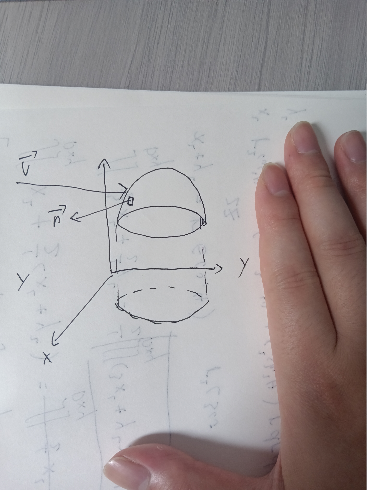
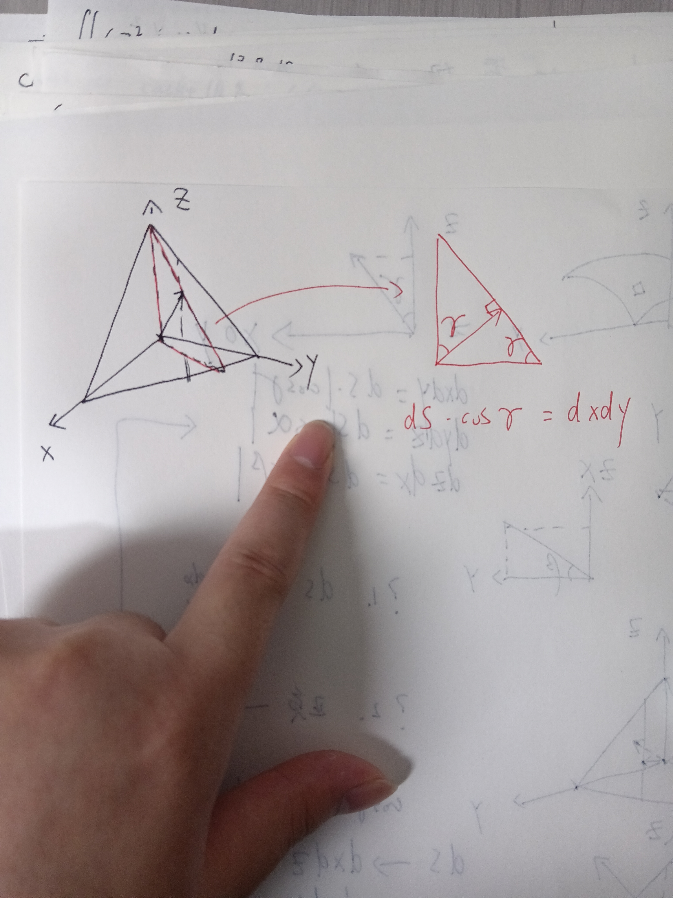
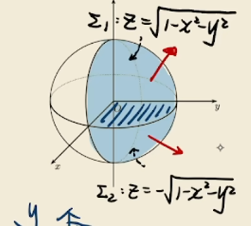
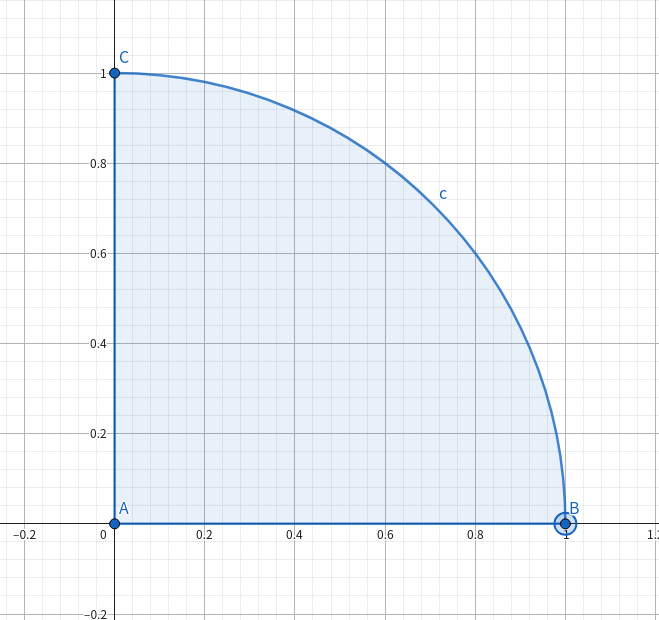
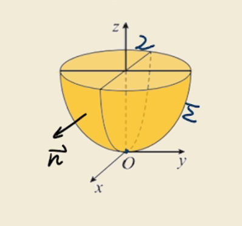

# 第二类曲面积分 ———— 求流量

在一个三维空间中，

1. 有曲面 $\sum: z = z(x, y)$
2. 有流量矢量 $\vec{v} = (P(x, y, z), Q(x, y, z), R(x, y, z))$

我们要求的是经过曲面$\sum$ 的流量，在曲面上取一小块面为 $dS$，经过这一面的流量微元为
$$
dF = \vec{v}\vec{n} dS
$$

其中 $\vec{n}$ 为单位化的法向量，有两种表示等价的描述形式

1. 假设 $\vec{n}$ 指向曲面外侧，上方，有
    $$
    \vec{n} = \frac{1}{\text{len}(\vec{n})}(-z_x', -z_y', 1) \\
    \text{len}(\vec{n}) = \sqrt{z_x'^2 + z_y'^2 + 1}
    $$
2. 假设 单位化法向量 $\vec{n}$ 与 $x, y, z$ 轴的夹角为 $\alpha, \beta, \gamma$，有
    $$
    \vec{n} = (\cos\alpha, \cos\beta, \cos\gamma)
    $$

    注意到 $\cos^2\alpha + \cos^2\beta + \cos^2\gamma = 1$

现在我们重新描述下流量微元，有
$$
dF = (P \cos\alpha + Q \cos\beta + R \cos\gamma)dS
$$

而对于 $dS \cos\gamma$ 

有 $dS \cos\gamma = dxdy$

同理，有
$$
\begin{cases}
dxdy = dS \cos\gamma \\
dydz = dS \cos\alpha \\
dxdz = dS \cos\beta
\end{cases}
$$

再次整理流量微元，有
$$
dF = Pdydz + Q dxdz + Rdxdy
$$

用积分表示流量为
$$
\text{Flux} = \iint \limits_{\sum} Pdydz + Qdxdz + Rdxdy
$$

但我们漏了一点，余弦有正有负，那么积分区域应该是
$$
\begin{cases}
dxdy = \pm dS \cos\gamma \\
dydz = \pm dS \cos\alpha \\
dxdz = \pm dS \cos\beta
\end{cases}
$$

那么，积分的每一个部分都要区分正负，有
$$
\pm \iint\limits_{\sum} Pdydz \pm \iint\limits_{\sum} Qdxdz \pm \iint\limits_{\sum} Rdxdy
$$

**法向量** 每个分量的正负 决定了 每个积分部分的正负  
假设有法向量 $\vec{n} = (a, b, c)$

1. 当 $a$ 为负时，$dydz$ 的积分**前面**取负号
2. 当 $b$ 为负时，$dxdz$ 的积分**前面**取负号
3. 当 $c$ 为负时，$dxdy$ 的积分**前面**取负号

## 第二类曲面积分的计算方法 ———— 一般情况/直接投影法/二重积分转换

如果我们要求曲面积分
$$
\iint \limits_{\sum} xyz dxdy
$$

其中 $\sum$ 是球面 $x^2 + y^2 + z^2 = 1$ 外侧，在 $x \ge 0, y\ge 0$ 的部分  
我们先画出这个曲面  
  

由曲面，我们将 $z$ 转为 $x,y$的函数，有 $z=z(x,y)$  
$$
\sum: z = z(x, y)
$$

现在被积分的函数变为 $x,y$ 的函数 $g(x, y)$  
由于我们是**对 $dxdy$ 进行积分**，积分变为二重积分的形式
$$
\iint \limits_{D_{xy}} xy\times z(x, y) dxdy
$$

1. 在曲面 $\sum_1$ 上，有 $z = \sqrt{1 - x^2 - y^2}$，有法向量(非单位化) $\vec{n} = (-z_x', -z_y', 1)$，$dxdy$ 部分的积分取正号
2. 在曲面 $\sum_2$ 上，有 $z = -\sqrt{1 - x^2 - y^2}$，有法向量(非单位化) $\vec{n} = (z_x', z_y', -1)$，$dxdy$ 部分的积分取负号

现在积分拆解为两个部分，在 $\sum_1$ 上有积分
$$
\iint \limits_{D_{xy}} xy \sqrt{1 - x^2 - y^2} dxdy
$$

在 $\sum_2$ 上有积分
$$
- \iint \limits_{D_{xy}} xy \times (-\sqrt{1 - x^2 - y^2}) dxdy
$$

两个部分相加，得到
$$
\iint\limits_{D_{xy}} 2xy\sqrt{1 - x^2 - y^2} dxdy
$$

在$xOy$上有积分区域，如下图所示

用极坐标代换，有
$$
\begin{aligned}
&x^2 + y^2 = r^2& \\
&x = r \cos\theta, \phantom{00} y = r \sin\theta& \\
&r \in (0, 1), \phantom{00} \theta \in (0, \frac{\pi}{2}) & \\
&\iint \limits_{D_{xy}} 2r^2 \cos\theta \sin\theta \sqrt{1 - r^2} r dr d\theta & \\
&= 2 \int_{0}^{\pi / 2} \cos\theta \sin\theta d\theta \int_{0}^{1} r^3 \sqrt{1 - r^2} dr&
\end{aligned}
$$

对后面的积分次进行微元替换，得到结果为 $\frac{2}{15}$

## 第二类曲面积分的计算方法 ———— 特殊情况

现在我们有曲面 $\sum$ 为 $2z = x^2 + y^2$ 在 $z = 0$ 到 $z = 2$ 的下侧，画出图像  

我们需要求
$$
\iint \limits_{\sum} (z^2 + x ) \text{dydz} - z \text{dxdy}
$$

### a. 使用直接投影法

既然曲面是下侧，有非单位化的法向量
$$
\vec{n} = (z_x', z_y', -1) = (x, y, -1)
$$

其中

1. 分量 $x$ 的正负 决定 $dydz$ 积分的正负
2. 分量 $-1$ 决定 $dxdy$ 积分的正负

于是，原来的积分的两个部分

1. $\text{part1}: \iint\limits_{\sum} (z^2 + x)dydz$ 在 $x > 0$ 时取正号，在 $x < 0$ 时取负号
2. $\text{part2}: \iint\limits_{\sum} z dxdy$ 取负号

对于第一部分，再次拆解，有
$$
\iint\limits_{\sum} (z^2 + x)dydz = \iint\limits_{\sum_1} (z^2 + x) dydz + \iint\limits_{\sum_2} (z^2 + x) dydz \\
= \iint\limits_{\sum_1} (z^2 + \sqrt{2z - y^2}) dydz + \iint \limits_{\sum_2} (z^2 - \sqrt{2z - y^2}) dydz
$$

再次进行正负判断，法向量 $\vec{n_1} = (x, y, -1)$ 在 $\sum_1$ 上 $x > 0$，在$\sum_2$上 $x < 0$  
那么，$\sum_1$上积分 取正号，$\sum_2$ 上积分取 负号，转换为二重积分，有
$$
\iint\limits_{D_{yz}} (z^2 + \sqrt{2z - y^2}) dydz - \iint\limits_{D_{yz}} (z^2 - \sqrt{2z - y^2}) dydz \\
= \iint\limits_{D_{yz}} 2\sqrt{2z - y^2} dydz
$$

其中
$$
y \in (-\sqrt{2z}, \sqrt{2z}), \phantom{00} z \in (0, 2)
$$

展开二重积分，有
$$
\int_{0}^{2} dz \int_{-\sqrt{2z}}^{\sqrt{2z}} 2 \sqrt{2z - y^2} dy
$$

得到结果为 $4\pi$，其中，右边的积分中，由于是对 $dy$ 进行积分，可以将 $z$ 看作常数，进行变量替换

第二部分的积分取负号，变换到二重积分，前面的负号变为了正号
$$
\iint \limits_{D_{xy}} z dxdy = \iint \limits_{D_{xy}} \frac{1}{2} (x^2 + y^2) dxdy
$$

得出结果也是 $4\pi$，最终答案为 $8\pi$

### b. 使用投影区域转换

在前面，我们知道
$$
\begin{cases}
dxdy = \pm dS \cos\gamma \\
dydz = \pm dS \cos\alpha \\
dxdz = \pm dS \cos\beta
\end{cases}
$$

而单位化法向量为
$$
\vec{n_1} = \frac{1}{len} (z_x', z_y', -1) = \frac{1}{len}(x, y, -1)
$$

也可以用与方向轴正方向的夹角表示，
$$
\vec{n_2} = (\cos\alpha, \cos\beta, \cos\gamma)
$$

我们发现，$dydz$ 可以用 $dxdy$ 表示，有
$$
dydz = \frac{dxdy}{\cos\gamma} \times \cos\alpha
$$

回到 $\vec{n_1}$，有
$$
\frac{\cos\alpha}{\cos\gamma} = \frac{x}{-1} = -x
$$

现在，可以将积分区域转到 $dxdy$，有
$$
\iint\limits_{\sum} (z^2 + x)(-x) dxdy - zdxdy
$$

我们知道，由于法向量 $z$ 的分量是负的，所以 $dxdy$ 部分的积分取负号，所以我们将积分投影到 $xOy$ 面，有
$$
\iint\limits_{D_{xy}} (z^2 + x)x + z \phantom{00}dxdy \\
= \iint\limits_{D_{xy}} \frac{1}{4}(x^2 + y^2)x + x^2 + \frac{1}{2}(x^2 + y^2) \phantom{00}dxdy
$$

而其中 $z^2 \times x$ 为奇函数，在积分区域中，结果为 $0$，现在积分又变为了
$$
\iint\limits_{D_{xy}} x^2 + \frac{1}{2}(x^2 + y^2) \phantom{00} dxdy
$$

再用极坐标代换，得到结果依然是 $8\pi$
