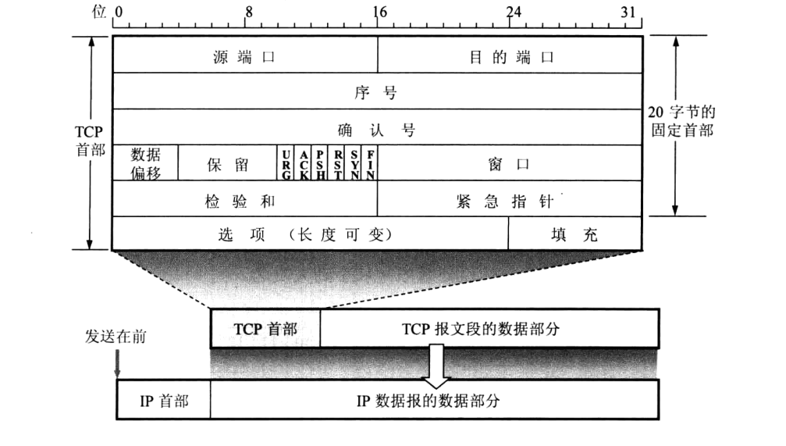

# TCP 协议


## 描述 TCP 功能的 结构体 (TCP 报文首部)



TCP 协议需要描述 连接 和 传输

**描述连接** 的信息有两种，一是 连接的信息，二是 连接的生命周期

1. 连接的信息  
    - 源端口: 对方从哪来
    - 目的端口: 对方到哪去
2. 连接的生命周期
    - SYN 标志位，发起连接
    - RST 标志位，重置连接，发生重大错误时使用
    - FIN 标志位，结束连接

**TCP的传输** 需要保证

1. 有序  
    - 序列号 seq
    - 确认号 ack，ACK 标志位 为 1 时有效
2. 高效  
    使用 窗口大小 (window size) 去描述还能发送/接收 多少数据
3. 可靠  
    使用 校验位 来判断是不是 正确的数据，或者判断是不是给自己的数据
4. **紧急处理** ，如果数据需要紧急处理，有两种方式
    - 全部梭哈  
      设置 PSH 标志位为 1，这样整个报文都会紧急传输
    - 梭哈一点(已废弃)  
      设置 URG 标志位为 1，然后从 数据部分开始 到 **紧急指针** 指向的部分 都是需要紧急处理的

**TCP 报文段首部** 中还有用来 设置自定义元数据 的字段，也就是 选项(optional)  
这个 optional 字段的有无得看 **数据偏移** 这个字段，这个字段占4个标志位  

- 如果 **报文首部** 无 选项 字段  
  那么 **首部** 就是定长的，为 20个byte，数据偏移 为 5(协议规定)，单位是4个byte
- 如果 **报文首部** 有 选项 字段  
  那么 **首部** 就是不定长的，数据偏移 最大为 15(1111)，单位是4个byte，报文首部最大长度 60个byte

我得补充一点，序列号这个东西 是用来 给字节流用的，不是给 报文用的  
举个例子，第一个字节编号为 1， 第二个字节编号为 2；而不是第一个报文段 编号为 1，第二个报文段 编号为 2

## 如何表示 TCP 的连接过程

上一节我们说过，在TCP报文首部 字段中有控制连接生命周期的

1. SYN
2. FIN
3. RST

在连接时，我们不需要用到 RST 标志位，可以忽略

我们规定，在请求连接过程中  
客户端发起连接时，设置 **SYN = 1** 和 **ACK = 0**  
服务端同意连接时，设置 **SYN = 1** 和 **ACK = 1**

等等，为什么有 **ACK** 标志位的参与？  
这是因为 我们需要 **ACK** 和 **ack 确认号字段** 来保证 **请求-响应** 这一过程的正确有序

### 发起连接 -- 投简历给 公司 求职

1. 客户端发起连接请求  
   我精心准备好了简历，投给一家公司  
   此时，我的简历是这样的

   ```json
    request {
        SYN: 1, // 表示发起连接请求
        seq: x // 随机的 x
    }
   ```

2. 服务端同意连接  
   公司收到了，发起录用通知
   此时，公司的回复我是这样的

   ```json
    response {
        SYN: 1, 
        ACK: 1, // SYN = 1 && ACK = 1 表示对 请求的回复
        ack: x + 1, // request.seq + 1, 表示对 `seq = x` 的简历确认
        seq: y // 随机的 y，问我什么时候可以上班
    }
   ```

3. 客户端告知服务端连接成功，可以传输数据  
   我收到了 公司的录用通知，并告诉公司我马上去上班  
   此时我回复公司

   ```json
    response_of_response {
        ACK: 1,
        ack: y + 1, // response.seq + 1, 表示对 公司录用 的回复
        seq: x + 1 // response.ack, 表示我 马上上班
    }
   ```

### 断开连接

1. 客户端发起停止连接请求，关闭对服务端的连接，并停止发送数据  
   这是家破公司，我向公司提出离职

   ```json
    request_fin {
        FIN: 1, // 表示停止
        seq: x // 表示 离职人员编号 是 x
    }
   ```

2. 服务端收到请求，发送确认
   公司收到离职通知，表示收到

   ```json
    response_1 {
        ACK: 1, // 表示回复
        ack: x + 1, // 表示对 `x` 的离职回复
        seq: y // 这个可以忽略
    }
   ```

3. 但是服务端还有点数据没有传输完，  
   公司启动员工离职程序，并表示，在离职前，让我把工作交接完

   ```json
    response_2 {
        FIN: 1, // 启动离职程序
        ACK: 1, // 表示回复
        ack: x + 1, // 表示这是对 `x` 的离职回复
        seq: w // 这个是无关字段，由于数据依然在传输，所以会变
    }
   ```

4. 客户端收到 服务端断联的响应后，发送已断联的通知  
   我他妈终于解脱了，对着老板比了个中指 🖕

   ```json
    response {
        ACK: 1,  // 表示回复
        ack: w + 1, // response_2.seq ，表示对 离职通知 的回复
        seq: x + 1, // response_2.ack ，表示 你们另请高明吧
    }
   ```

5. 客户端 等待 2MSL 后，关闭连接  
   我离职后，在家等待一段时间，防止有工作没有交接完成，等待时间一过，拉黑所有联系方式

## 数据传输

TCP 在进行数据传输时，需要确保数据的可靠性，他需要保证

1. 准确  
   这个数据是给我的还是给他的，这个通过 **校验和** 来判断

   比如拉痔疮的时候，先判断你是躺着的还是趴着的，要是躺着的  
   做完手术，大夫还纳闷: 不是说是内痔吗，怎么是两个外痔，还这么大，管他呢，反正切完了
2. 有序  
   只有速度快不行，得按照顺序一步一步做，这通过 **序列号 seq** 字段来说明

   割包皮的时候，第一步要褪毛，第二步要消毒，第三步要打麻醉，第四步手起刀落，第五部缝合  
   准备好手术了，医生看见手头缺了 褪毛的工具，让护士赶紧把工具去来，不然这手术做不下去
3. 高效  
   直接告诉对方，给我 哪个编号 的数据，这通过 **确认号 ack** 字段来说明

   这就好像在一场手术中，主治医生只有两双手，拿不了太多刀，旁边护士准备好了一堆工具  
   主治医生做完一部分，吩咐护士---擦汗，又吩咐护士---钳子，再吩咐---剪刀

___
但是我们还要考虑传输过程中出错 如何处理，其实错误有两种

1. 校验出错  
    也就是说，这个TCP报文不是给我的，那我沉默，不应答  
    别人收到了，并确定是他的，那就应答

    护士喊，请 1 号患者到手术室 割痔疮，其他不是一号的患者瑟瑟发抖，全都沉默，不敢动弹
2. 网络抖动  
    网络抖一抖就有可能丢包，这个时候需要重传，重传策略有两种

    - 一是一种简单的方法，名 超时重传  
    **发送端** 为每个传输的 TCP报文 设置计时器，直到计时器超时，都没有收到这个报文的确认时，进行重传

    - 二是一种巧妙的方法，名 快重传  
    **发送端** 收到某个序号的确认报文三次时，对这个序号的报文进行重传

## 传输中遇到了 堵塞/性能瓶颈

### 单节点/流量控制/被动

我们先看简单的情况，只有双方节点在进行数据传输，  
双方之间在各自的报文中 设置 **window size** 字段来告诉对方还能 传送/接收 多少数据

- 接收方设置 **window size** 告诉发送方 还能接收多少数据
- 发送方设置 **window size** 告诉接收方 还能发送多少数据

这就好像在路上开车，得看限速牌，限速60，时速80，松油门；限速100，时速80，踩油门

### 多节点/拥塞控制/主动

再来看复杂的情况，网络中有很多节点，每个节点都在占用一定带宽，在对接收端进行数据传输时，就一定要考虑到其他节点的情况  
我们这样来解释 **发送端** 的行为

#### 慢启动

你出身卑微 (发送端设置 **窗口大小** 为1)  
靠着自己的努力，走上仕途，从此平步青云 (发送端 **窗口大小** 几何增大) ，立下很多功劳

#### 拥塞避免

很快你就到了封无可封的地步 (**窗口大小** 抵达 **阈值**)  
从此你就只能小心翼翼做事 (**窗口大小** 线性增大)  

#### 网络抖动

突然有天变故来了，你 *包二奶* 的事被人捅出去了 (出现 **轻微** 的网络抖动)  
___

在旧时代，朝堂上的人 恨不得 弄死你，于是以此为借口，对你做出惩罚，  
于是你喜提 贬为庶民 (**窗口大小** 设置为 1)  
但是你还是可以为官的，朝廷的奖惩制度一项公正 (再次 **慢启动**)  
不过朝堂上的人为了防止你东山再起，有好多双眼 死死的盯着你，等着给你下绊子，好让你再次贬为庶民 (**阈值** 调整为 最大窗口大小的 一半)  

___
如果是新时代，纪委的人发现 *包二奶* 只是作风问题，没有涉及到原则，于是  
对你进行必要的惩罚 (**窗口大小** 设置为一半)  
并设置观察期  (**阈值** 设置为 **窗口大小** ，此时为最大窗口值的一半)  
你必须小心翼翼的应付过去 (拥塞避免)

下一次你犯这种作风问题的错误时，还是这个处理流程

___
但是，如果是重大错误，不管是新时代还是旧时代，还是得 贬为庶民 (**窗口大小** 设置为 1)  
还是得从头开始 (慢启动)

## TODO: 补充：差错检测

由于TCP报文首部只记录了 **源端口号** 和 **目的端口号** ，而没有记录 **源IP** 和 **目的IP** ，导致接收端不知道报文是不是给自己的