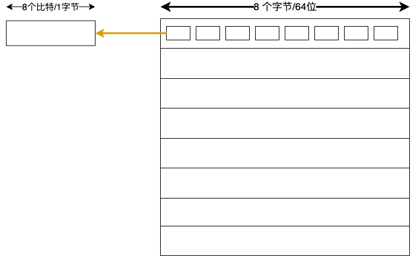
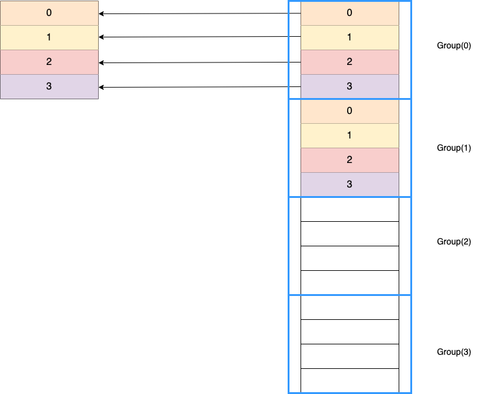
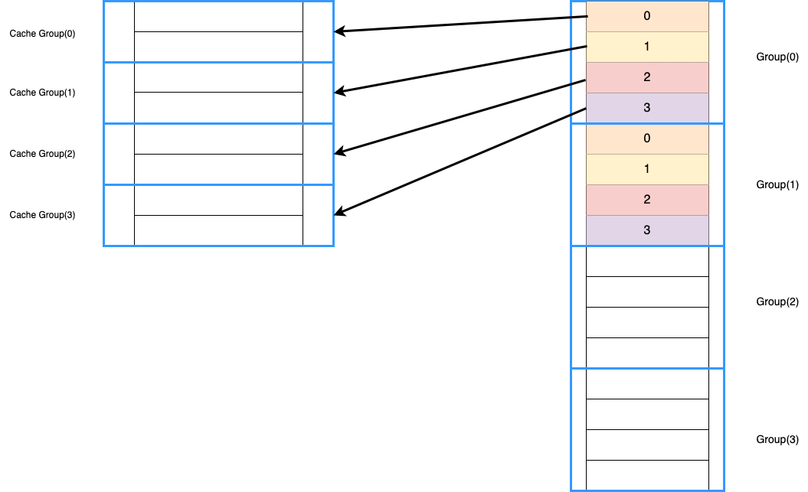

# Cache

## 介绍


**Cache** 在CPU与主存之间，用作对 主存数据的映射，从而加快 CPU 对主存的访问

既然是对主存的映射，那该如何对主存进行映射呢？  
映射完毕后，CPU要访问主存中的数据怎么办，访问没有命中怎么办  
如果CPU需要往主存写数据，cache 又该如何同步其中的数据到 主存上呢

## 预备知识: 内存地址的表示

我们知道，在内存操作中，我们不会一位一位的去移动指针，而是一个字节一个字节的去移动，因此内存块的大小也是一个字节(1byte/8bit)的倍数，这不仅是为了内存对齐，也是为了加快访问速度  
既然已经知道了 内存是一个字节一个字节的去访问的，那么地址也是以一个字节为单位的

我们看一个真实内存地址的例子，假设这个内存被分为一行一行，每一行有 64位 (64bit, 8byte)



我们通过 **内存行号** + **行内偏移** 来标识独一无二的地址  
既然行内有8个字节，并且 $2^3 = 8$ ，我们可以用 3 位二进制数去表示 **行内偏移/块内偏移**

## cache 用作读内存 -- 映射 主存地址 到 cache 上

### 全相联映射

映射，就是说有一个函数能把 原始的 `64` 位地址 映射到 cache 的某个位置  
在全相联映射中，地址可能会被映射到 **任意一行** 位置，这是最简单，也是最容易想到的一种方法

从软件的视角来看，对于一个原始的64位地址，经过 **译码阶段**，会生成一个表示地址的结构体，其中包含了

1. 内存索引/内存行号 (0-based)
2. 内存行内偏移/块内偏移

```rust
struct Address {
    index_of_memory_lines: usize,
    offset_in_block: usize
}

impl Address {
    fn from(raw_address: u64) -> Self
}
```

此时 **cache 行** 中存储了 **内存行号**

```rust
struct CacheLine {
    metadata: CacheLineMetadata,
    index_of_memory_lines: usize,
    data_copied: u64,
}

struct CacheLineMetadata {
    is_dirty: bool,
    is_valid: bool
}

struct Cache {
    lines: [CacheLine; CACHE_LINE_NUMBER]
}
```

在查找 cache 时，会逐一比较 cache行中的 内存行号 是否与 `Address` 的内存行号匹配

```rust
impl Cache {
    fn find(&self, raw_address: u64) -> Option<&CacheLine> {
        let address = Address::from(raw_address);
        self.lines.iter().find(|line| {
            line.index_of_memory_lines == address.index_of_memory_lines
        })
    }
}
```

找到匹配 cache 行后，根据 块内偏移 进行查找

### 直接映射

直接映射，不像 全相联映射 那样，会通过 先后顺序 将内存地址 "映射" 到任意cache行，而是会通过某个函数规则，将地址固定的映射到 某一位置  
这个函数规则，我们通常取 mod 模运算

假设 cache 有 4 行，内存行号 从 0-15 的映射是

```
0 mod 4 = 0
1 mod 4 = 1
2 mod 4 = 2
3 mod 4 = 3
4 mod 4 = 0
5 mod 4 = 1
6 mod 4 = 2
7 mod 4 = 3
8 mod 4 = 0
9 mod 4 = 1
10 mod 4 = 2
11 mod 4 = 3
12 mod 4 = 0
13 mod 4 = 1
14 mod 4 = 2
15 mod 4 = 3
```

我们发现，这个映射是一个周期性循环，也间接的将所有内存行 分为了多个组  
以上面为例，0-15的映射有4个循环，也就是被分为了4个分组  
那内存结构可以看作



那我们表示一个内存行，可以通过

1. 内存组号
2. 组内偏移/cache 行号

这个 **组内偏移** 就是指在组内第几行  
然后，我们再通过 内存行内偏移/块内偏移 得到具体地址

至此，我们知道，对于一个原始的64位地址，经过 **译码阶段** ，会生成一个表示地址的结构体，其中包含了

1. 内存组号
2. 组内偏移/cache 行号
3. 内存行内偏移/块内偏移

```rust
struct Address {
    index_of_memory_group: usize,
    index_in_memory_group: usize,
    offset_in_block: usize
}

impl Address {
    fn from(raw_address: u64) -> Self
}
```

此时，在 cache行中查找匹配地址时，需要比较

1. cache 行的 **行号** 与 `Address` 的组内偏移/cache 行号
2. cache 行的 **内存组号** 与 `Address` 的内存组号

我们知道 cache行的 **行号** 实际上就是 cache行的 索引，即数组索引，那么我们想要访问 行号为 `n` 时，只需要像数组那样进行访问就好

```rust
cache.lines[n]
```

那么 cache 行 就不用保存 **行号** 这个东西了，只需要 **内存组号** 即可，此时 cache 的结构为

```rust
struct CacheLine {
    metadata: CacheLineMetadata,
    index_of_memory_group: usize,
    data_copied: u64,
}

struct CacheLineMetadata {
    is_dirty: bool,
    is_valid: bool
}
```

寻找匹配地址时

```rust
impl Cache {
    fn find(&self, raw_address: u64) -> Option<&CacheLine> {
        let address = Address::from(raw_address);
        let cache_line = &self.lines[address.index_of_memory_group];
        
        if cache_line.index_of_memory_group == address.index_of_memory_group {
            Some(cache_line)
        } else {
            None
        }
    }
}
```

### 组相联映射

组相联映射可以看作 直接映射 的改进  
在直接映射 中，我们将 地址映射到 **cache 的行**  
在组相联映射中，我们将 地址映射到 **cache 的组**

是的，这次我们将 cache 进行了分组，如果两个cache 行作为一组，那我们称其为 二路组相联 映射



在直接映射中，我们是这样描述地址的

1. 内存组号
2. **组内偏移**/cache 行号
3. 内存行内偏移/块内偏移

在这里 组内偏移 不再用作 索引 **cache 行**，而是 索引 **cache 组**
那地址结构依然是

```rust
struct Address {
    index_of_memory_group: usize,
    index_in_memory_group: usize,
    offset_in_block: usize
}
```

在 cache 查找时，我们先

1. 用 `Address` 的组内偏移 找到 cache行 的组
2. 在 cache 组中 遍历查询，看看 有没有哪行的 内存组号 匹配 `Address` 的 内存组号

这里我们要调整下 cache 的结构 和 查找过程

```rust
struct Cache {
    number_in_group: usize, // 多少路组相联
    lines: [CacheLine; super::CACHE_LINE_NUMBER]
}

impl Cache {
    fn find(&self, raw_address: u64) -> Option<&CacheLine> {
        let address = Address::from(raw_address);
        let index_cache_group = address.index_in_memory_group;
        let index_cache_line = index_cache_group * self.number_in_group;
        
        let mut start_index = index_cache_line;

        let mut loop_count = 0;
        while loop_count < self.number_in_group {
            let cache_line = &self.lines[start_index];
            if cache_line.index_of_memory_group == address.index_of_memory_group {
                return Some(cache_line);
            }

            start_index += 1;
            loop_count += 1;
        }

        return None;
    }
}
```

## cache 用作读内存 -- cache 替换策略

上述情况我们讨论了 主存地址 到 cache 的映射规则  
但是我们发现一个问题，如果映射到的地方已经被占了，这个时候该怎么办呢？  
我们知道 cache 的容量有限，可以将暂时用不到的内存映射替换掉，但是我们有三种 映射策略，我们该如何进行替换呢？

对于 **直接映射**，由于 映射规则 只能让地址 映射到 特定位置，没有什么空闲位置 能够再放置映射  
对于 **全相联映射** ，我们可以采用

1. 先进先出 FIFO
2. LFU (Last-Frequency-Usage) 看各cache行 的使用频率，把使用频率低的替换掉
3. LRU (Last-Recent-Usage) 看各cache行最近是否有被使用过，把最近没使用过的替换掉
4. 随机替换，就跟随机找个程序员 进行祭天是一样的

对于 **组相联映射** ，我们在组内使用上述四种情况即可
___

我们讨论完了 替换策略，我们再来说说如何调整 cache行 硬件结构 使其支持上述的
LFU 和 LRU 策略  
对于这两种策略，我们为每一行添加一个计数器 `counter`

1. 在 LFU 策略中，一行cache命中时，`counter += 1` 表示命中频率增加  
2. 在 LRU 策略中，一行cache命中时，`counter = 0` ，其他行的 `counter += 1` ，表示没有使用的次数增加

## cache 用作写内存 -- cache 写策略

我们知道，RISC 5段流水线中有个 **访存阶段** ，意为将运算结果 写入内存  
这里为了加快流水线速度，工程师对访存阶段做了一些改进，先把 访存阶段的数据 写入 cache(因为以后可能还需要进行更改，鉴于局部性原理)，等待时机将cache中的数据写入主存

当 cache 命中时，我们有两种策略

1. 同时往 cache行 和 主存中写，这叫做 **全写法**  
同时我们发现，每次写 cache 都要 写主存，不如我们再加个 **缓冲队列**，保存要写的数据，队列一慢，一股脑的写入主存，这样能加快一点
2. 写入 cache行 后，就放那不管，等到要替换了，才将数据同步到 内存中，这叫做 **写回法**

这两个策略就像是 一个勤劳的工人(全写法) 和 一个懒惰的工人(写回法)  
不管什么时候写入cache，最后都要同步到 内存中，这时勤劳的工人 管你这个那个的，要写cache了，就同步到主存中  
但是懒惰的工人 写入后就不管了，如果上头下了命令(替换cache行)，才不情不愿的去同步内存

但 cache 未命中时，我们也有两种策略

1. 发现没有命中，我们将主存数据载入cache，并修改cache，这叫做 **写分配法**
2. 发现没有命中，直接往主存中写入数据，并没有将数据载入 cache ，这叫做 **非 写分配法**

这两个策略就像是 一个 **记性好** 的工人(写分配法) 和 一个 **记性差** 的工人(非 写分配法)  
鉴于局部性原理，载入cache的数据可能在以后要用到多次，记性好的工人在写数据时，先把数据载入cache中，再进行修改，而记性差的工人做完之后，会全忘掉，啥都不会记住
