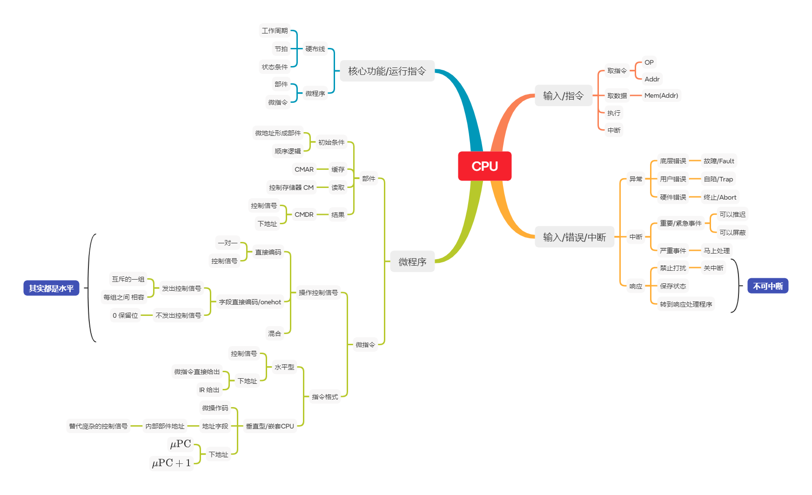
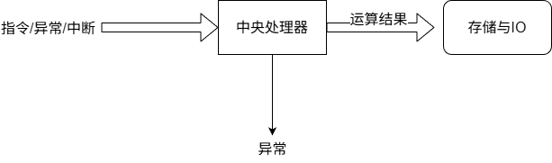
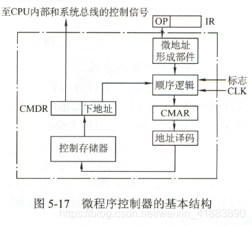
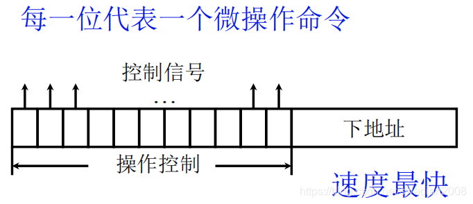
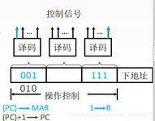
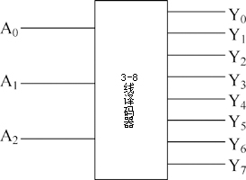

# 中央处理器



如果将 中央处理器 看作一个函数

```
fn cpu(input: Instruction | Interrupt) -> Result<Data, Error>
```

于是，我们这样整理 CPU 相关内容


## 输入 指令

我们知道，指令周期有四种

1. 取指周期
2. 间址周期
3. 执行周期
4. 中断周期

其实他的意思是，CPU 先要从 内存中取一个指令，对应 **取值周期** 这个指令可能张这样

```
[AddToAcc | SourceAddr ]
```

取到了指令还不能运行，我们不知道 `SourceAddr` 这个地址所存储的数据是什么，  
这个时候，CPU 需要访问内存，取出 `SourceAddr` 的数据，对应 **间址周期**

现在数据准备完毕，可以执行了，对应 **执行周期**  

**中断周期** 是为了处理中断事项的，这是工程师长期实践下来的规定，就好比学校规定 你下课了 才能去上厕所

## 输入 异常和中断

异常和中断为什么放在一起呢？因为他们在本质上一样的东西，你也可以混为一谈  
异常有三种

1. 故障/Fault，即底层的软件错误，比如缺页，缺段 错误
2. 自陷/Trap，即用户层面的软件错误，比如我闲的没事，自己 `throws` 一个 `Error` 出来
3. 终止/Abort，即硬件的错误，比如我直接按下关机键，或是把电源线剪了

中断有两种

1. 重要/紧急 的事，可以先判断有多重要，多紧急，然后根据优先级设置，是去处理呢，还是不管呢
2. 严重事故，必须要处理，无视优先级，比如你放在衣柜里的飞机杯被妈妈发现了

## 核心功能 运行指令

### 硬布线控制器

CPU 中专门运行指令的部件叫做 **CU** ，即控制单元  

在早期设计阶段，我们用 硬布线控制器 来执行指令  
硬布线，其实你也可以叫他组合逻辑电路，他组合了以下输入

1. 节拍
2. 标志 (FE = 取指令周期，IND = 间址周期，EX = 执行周期，INT = 中断周期)
3. 操作码(from IR)

根据种种逻辑运算，输出一系列控制信号

### 微程序控制器

还有一种方式，他将指令的处理程序存储到一个 ROM 中，即 CM ，微控制存储器  

**特别注意**

1. 这里要强调下 CM 的读取方式，假如 CM 有 8条输入引线，同一时间，只能有一条有效，  
但是微地址只有 3 位，需要通过 地址译码这个 3-8 译码器 进行处理，输入到 CM 中
2. 若是生成了 顺序逻辑，为什么还要有 CMAR 这个东西作为缓冲呢？  
因为从ROM 中读取需要一定时间，有可能还没输出结果呢，新的微地址又到了，CM 没办法存储这个地址信号；  
还有一种可能，新的微地址生成了，但是还没到可以运行的节拍，这个时候不能进行读取



接下来我们解析下 微程序控制器 的功能  
这个结构可以看作一个函数

```rust
fn microprog(micro_address: Pointer<MicroInstruction>, clock: Clock, flag: Flag) -> (Vec<ControlSignal>, Pointer<MicroInstruction>)
```

他 **输入** 了

1. 微地址
2. 标志 flag
3. 时钟信号 CLK

他会 **输出** **微指令** 到 CMDR ，**微指令** 由这些构成

1. 一系列控制信号 `Vec<ControlSignal>`
2. 下地址，即下一个微指令在 CM 中的地址 `Pointer<MicroInstruction>`

为什么要这样设计 输出格式呢？因为我们需要运行 `OP` 所对应的所有 微指令，寄存器容量有限，不能一次性取出  
你看看这个 CMDR 结构，是不是很像 链表节点的结构啊，他就是一个用来完成循环遍历的结构

```rust
struct MicroInstruction {
    operating_code: OperatingCode,
    next_address: Pointer<MicroInstructioin>
}
```

他的 **核心功能**，就是从 **CM** 中读取出 *一系列控制信号* 和 *下地址*  
既然是循环遍历，我们该怎么用代码来描述这个结构呢

```rust
// 循环初始化
let operating_code = OP(IR);
let micro_address = micro_address_generator(operating_code);

// 循环
loop {
    let micro_address = serial_logic(micro_address, clock, flag);
    let micro_address = write_to_cmar(micro_address); // the same
    let pin = address_translate(micro_address);  // 获取引线
    let (micro_instruction, next_address) = read_from_cm(pin);
    micro_adress = next_address; // 下一次循环
}
```

循环初始化时  

1. 从 `IR` 中提取 操作码，由 **微地址形成部件** 形成初始 微地址  
2. 微地址 传递给 **顺序逻辑**

开始循环  

1. **顺序逻辑** 在合适的 **标志** 和 **CLK** 时 将 **微地址** 传递CMAR缓存
2. CMAR 中的数据，经过地址译码，传递个CM中的引线
3. 从 CM 中读取出 `(Vec<ControlSignal>, Pointer<MicroInstruction>)`
4. 将微地址 `Pointer<MicroInstruction>` 传递给 **顺序逻辑**
5. 回到 步骤1

我们注意到，下地址 可以由 IR 生成 (初始地址) 或者从 CM 中读取

### 微程序的微指令

#### a.1 水平型微指令 with 直接编码方式

我们知道，CM 输出的微指令 有

1. 一系列控制信号
2. 下地址

我们看这样一张图



**CMDR** 在 **操作控制** 这一块中，每个位代表一个微操作命令，这其实就是一个 位图(bitmap) 结构，也叫做 **直接编码** 方式  
但是这种方式需要的操作控制位 实在太多了，并且，如果有 多个控制信号 是互斥的，又需要添加一个预处理器，增加了硬件的复杂度

#### a.2 水平型微指令 with 字段直接编码方式

于是，我们为了 缩短 **操作控制位** 的长度，并避免信号冲突，我们采用 **字段直接编码方式** ，如下图所示



在上述的 **直接编码** 方式中，一个位(bit) 代表一个控制信号  
我们调整一下，将 n 个位作为一个字段，并将这个字段看作一个 **定长整数** 而不是 true/false ，译码器把这个数字 重新输出为控制信号，这属于是，先压缩，再解压  
看不懂？我换种说法，画个图



左边的就是分段内的数据，右边的就是解码后的数据  
这样虽然缩短了 操作控制位 的长度，但原来的一系列控制信号 需要多次生成  
那么我们该如何避免 信号冲突 呢？这里我们将会生成 **互斥信号** 的控制位放到一个字段中，如上述所说，这时候 字段不是 位图结构，而是被看作一个数字，经过 译码器，只能使输出的一条引线有效，不可能有两条引线输出

#### a.3 补充 空指令

某些指令，在某个指令周期是不工作的，此时在 **直接编码** 中，操作控制位 都是0，而在 **字段直接编码** 中，我们规定，保留分段内全为0 作为 **空指令**，即什么都不做

#### b. 垂直型微指令

对硬件来说，水平型微指令 的操作控制位 实在太长了，并且这个 控制信号 实在太繁杂，难以设计  
既然都是对 **CPU内部组件** 的访问，为什么不能调整 微指令结构，从而替代这繁杂的控制信号 呢？这就是 垂直性微指令 的设计目的，一个垂直微指令可能看起来像这样

| 字段 | 操作码 (Opcode) | 源寄存器1 (Src1) | 源寄存器2 (Src2) | 目的寄存器 (Dest) |
| :--: | :--: |:--: |:--: |:--: |
| 位宽 | 4位 | 3位 | 3位 | 3位 |

那么这种指令的下地址 怎么不像 水平型微指令那样在 指令中指出呢？  
这是因为 垂直型微指令 是模仿指令设计的，他的下地址就好像存在 PC 这个寄存器一样，会存在 $ \mu \text{PC}$ 这个寄存器里，执行完一条微指令后，$\mu \text{PC}$ 自增一条微指令长度

## 核心功能 响应中断/异常

处理错误时，都会有相应的错误处理程序，要么忽略掉这个错误，要么处理这个错误，等待下个周期继续执行，要么直接抛给上层，让上面的来解决  
处理错误的程序，不在这一节讨论范围内，我们探讨的是，处理错误的整个流程

1. 首先，开启 **关中断**，即屏蔽其他错误，因为他们会打扰整个错误处理过程
2. 保存当前程序状态(PC 和 其他寄存器)
3. 转到 错误处理程序

整个过程不可被中断

## 输出 运算结果

这节内容我们放到 后面的 **存储与IO** 来讲

## 补充 数据通路 / CPU 内部

懒得弄  
内部总线中，每个组件都有一个 in 和 out 开关，代表 数据的流入 和 流出，开关由CU控制，

有三条外部总线

1. 控制总线
2. 数据总线
3. 地址总线

## 补充 CPU 中的部件 及其 作用

- **IR**: `Instruction`
- **PC**: `Pointer<Instruction>`
- **MDR**: `Data`
- **MAR**: `Pointer<Data>`
