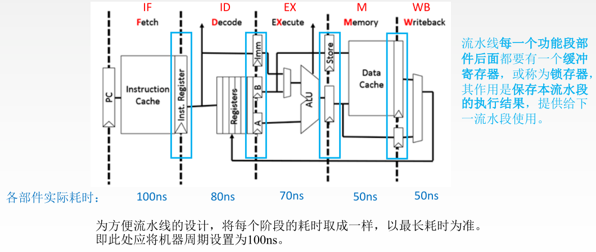
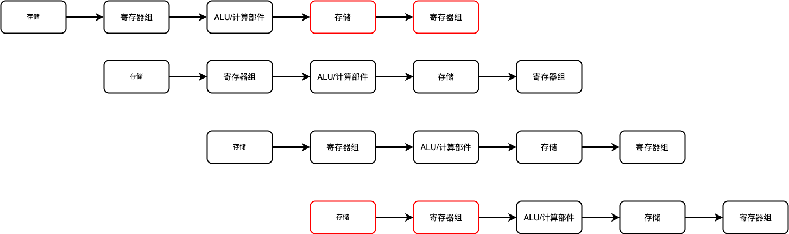
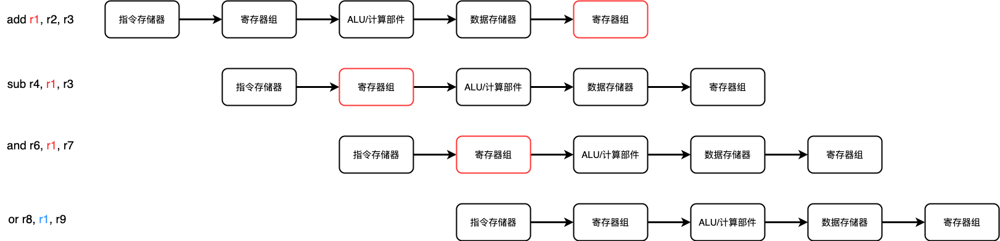
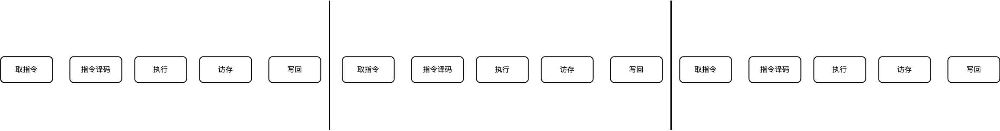
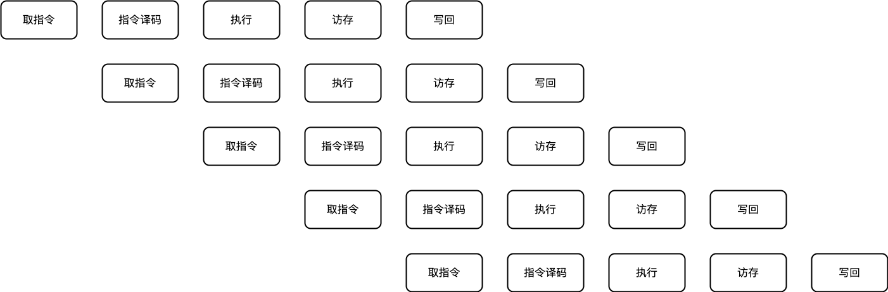

# 中央处理器改进 -- 流水线/多处理器


## 传统指令/CISC 回顾

我们知道，在传统指令设计中，有如下 指令周期

1. 取指令
2. 间址
3. 执行
4. 中断

以如下代码为例

```assemble
add <mem-src> <mem-dest>
```

这段指令将 `<mem-src>` 处的整数 与 `<mem-dest>` 处的整数 相加，并将结果存入 `<mem-dest>`  
在执行这段指令时，我们发现 需要

1. 读取 <mem-src>
2. 读取 <mem-dest>
3. 写入 <mem-dest>

至少三次访存，而内存访问的速度 相比于CPU内部的运算速度，慢的不是一个量级，且整个运行时间难以预测，难以为其设计 指令流水线

## 指令改进/RISC/MIPS 与 流水线实现

MIPS 中是如何执行 `add` 呢？  
MIPS 指令设计时，遵循了一个原则，访存只能由 `store` 和 `load` 两个指令来执行，其他指令 绝对不能进行访存  
在 MIPS 中，我们对指令集进行了改进，并这样运行 CISC中的 `add <mem-src> <mem-dest>`

```nasm
load <reg-1> <mem-src>  # 将 <mem-src> 的数据 载入 <reg-1> 寄存器
load <reg-2> <mem-dest> # 将 <mem-dest> 的数据 载入 <reg-2> 寄存器
add <reg-1> <reg-2>     # 将 <reg-1> 和 <reg-2> 的数据相加，并存入 <reg-1>

store <mem-dest> <reg-1> # 将 <reg-1> 的数据存入 <mem-dest> 中
```

别看他需要那么多段指令才能完成一个 加法指令 执行，可以仔细看到，每个指令只专注于一件事，这正好是 流水线需要的

我们以 MIPS 5段流水线为例，指令集被重新设计，并将一条指令 重新划为 5个阶段

1. 取指令
2. 指令译码
3. 执行
4. 访存
5. 写回

对照上述的 `add` 全过程，我们分析下这四条指令的执行过程

1. `load <reg-1> <mem-src>`
    - 取指令，将 `load <reg-1> <mem-src>` 从 **内存/指令存储器** 中取出
    - 指令译码，需要从 CU 中知道指令如何执行
    - 执行，计算 逻辑地址 `<mem-src>` 对应的物理地址 存储到某个寄存器 `z1`
    - 访存，通过 `z1` 处存储的地址 访问 内存，并将结果存储到某个寄存器 `z2`
    - 写回，将 `z2` 存储的数据 写入到 `<reg-1>`

2. `load <reg-2> <mem-dest>`  
    同上

3. `add <reg-1> <reg-2>`
    - 取指令
    - 指令译码，从 CU 中知道 指令如何运行
    - 执行，ALU执行加法操作，数据存储到 某个寄存器 `z`
    - 访存，**这里不需要**
    - 写回，将 寄存器 `z` 的数据 写入到 `<reg-1>` 中

4. `store <mem-dest> <reg-1>`
    - 取指令
    - 指令译码
    - 执行，计算 `<mem-dest>` 的物理地址，结果存入某个寄存器 `z`
    - 访存，通过寄存器 `z` 中的地址数据 访问主存
    - 写回，**这里不需要**

我们注意到，每个指令执行完后，我们假设有某个寄存器 可以用作存储，我们看看 MIPS 5段流水线的数据通路



那几个蓝色长条圈出来的就是 各阶段之间 用来进行数据暂存的 寄存器，有

1. IF/ID 寄存器
2. ID/EX 寄存器
3. EX/MEM 寄存器
4. MEM/WB 寄存器

这样每个阶段之间都有一个承接的寄存器，这样就知道 数据从哪个阶段来，省去一些繁琐的判断，并减少硬件设计复杂度

那么我们调整下上述 指令的运行过程

1. `load <reg-1> <mem-src>`
    - 取指令，将 `load <reg-1> <mem-src>` 从 **内存/指令存储器** 中取出
    - 指令译码，需要从 CU 中知道指令如何执行
    - 执行，计算 逻辑地址 `<mem-src>` 对应的物理地址，并将其存储到 **执行/访存 寄存器** 中
    - 访存，通过 **执行/访存 寄存器** 处存储的地址 访问 内存，并将结果存储到 **访存/写回 寄存器** 中
    - 写回，将 **访存/写回 寄存器** 中的数据 写入到通用寄存器组中的 `<reg-1>` 中

2. `load <reg-2> <mem-dest>`  
    同上

3. `add <reg-1> <reg-2>`
    - 取指令
    - 指令译码，从 CU 中知道 指令如何运行
    - 执行，ALU执行加法操作，数据存储到 **执行/访存 寄存器** 中
    - 访存，**这里不需要** 进行访存操作，将 **执行/访存 寄存器** 中的数据 透明传输到 **访存/写回 寄存器** 中
    - 写回，将 **访存/写回 寄存器** 的数据 写入到 `<reg-1>` 中

4. `store <mem-dest> <reg-1>`
    - 取指令
    - 指令译码
    - 执行，计算 `<mem-dest>` 的物理地址，结果存入 **执行/访存 寄存器** 中
    - 访存，通过寄存器 **执行/访存 寄存器** 中的地址数据 访问主存，并将 `<reg-1>` 中的数据写入
    - 写回，**这里不需要**

___
**补充**

指令译码阶段，有个 **读寄存器文件** 阶段，其实就是从指定的通用寄存器 中读取数据，读取到哪里呢？ 读取到各指令周期间的 暂存寄存器，没有那么复杂的

## 流水线的冲突与冲突处理

流水线运行时，并不是那么理想，我们发现了几种冲突  
这是一条指令运行时 需要用的结构  


但在流水线中，指令一多，我们发现



1. 第一条指令的 访存阶段与 第四条指令的 取指令阶段 都要用到存储器，产生了 冲突
2. 第一条指令的 写回阶段与 第四条指令的 指令译码阶段 都需要用到 寄存器组，产生了 冲突

这种部件上的冲突 我们叫做 **资源冲突**  
针对第一种情况，我们可以将存储分为 **数据存储器** 与 **指令存储器**  
第二种情况，我们可以在冲突阶段 插入气泡/空操作，暂停一个周期
___
在涉及到有数据依赖的计算时，我们发现  
对于代码

```nasm
add r1, r2, r3
sub r4, r1, r3
and r6, r1, r7
or r8, r1, r9
xor r10, r1, r11
```

多条指令需要用到 `r1` 寄存器


我们看到在 第二条指令 需要用到 `r1` 寄存器，而此时 `r1` 寄存器 还没有正确写入数据，此时数据是无效的，需要等到 第一条指令 写回阶段 完成后才能去读取，此时我们可以 **暂停这个指令**，插入硬件气泡，或者什么都不做，执行 NOP 指令

其实 `r1` 寄存器需要存储的数据在 第一条指令 执行阶段 计算完毕后就已经产生了，完全可以从 ALU 中添加一条线路到 寄存器组 中，这就是 **数据旁路技术** ，其实就是半道截胡，省去了后面的 访存和写回 阶段的等待

还有一种方法，由编译器对代码进行 **编译优化**

___
上述我们讨论的都是顺序执行的情况，但如果是跳转呢(函数调用和分支跳转)  
跳转时，原先的流水线顺序被打乱，对于函数调用，我们确实无能为力，但是可以对分支跳转进行优化

1. 预测会到哪个分支上
2. 对每个分支所需要的指令进行 预取
3. 提前形成 分支跳转的 条件码

## 流水线 性能指标

1. 加速比: **使用流水线时** 比 **没有使用流水线时** 快了多少
2. 吞吐率: **使用流水线时** ，在单位时间内完成的任务数量

针对没有流水线的情况，多条指令执行时
  
只能一条一条的执行  
而对于k段流水线，我们可以并发执行k条指令，这里以5段流水线为例


假设执行一条指令所需时间为 $t$  
执行完$n$条指令，在使用流水线时，用时为
$$
(k + n - 1)t
$$

不使用流水线，就是将上图的结构平铺，用时为
$$
k n t
$$

可以得到 **加速比** 为
$$
S = \frac{kn}{k + n - 1}
$$

___
假设有 $n$ 个任务，每完成一个任务需要 $t$ 时间，完成所需要的时间为
$$
(k + n - 1)t
$$

得出 **吞吐率** 为
$$
TP = \frac{n}{(k+n-1)t}
$$

## 多处理器

### 并行模型

多处理器，我们很容易想到显卡这个东西，这个东西是为了图形渲染设计的，由于CPU是用作通用的计算部件，一次只能计算一个数字  
显卡就不一样了，他内部有成千上万个计算单元，可以一次性处理成千上万个数据，这也是为什么他被用作矩阵计算的原因，但是他不是通用的，对浮点计算和带条件(if语句)的计算 支持不怎么样

上述的显卡，可以归类为 **SIMD** ，即 **单指令流，多数据流** ，一条指令操作多条数据，传统的CPU是 **SISD** ，即 **单指令流，单数据流**  
由于我们讨论的是模型，不是软件，**MISD** ，即 **多指令流，单数据流** 这种架构及其少见，或是压根就不存在，我们不做讨论

**MIMD** 是一种更高级的并行模式，可以参考 分布式计算，不做解释，因为我不会 😂

### 硬件实现

为了实现并行，工程师们发明了多处理器，其硬件实现有两种方式
多处理器，顾名思义，就是用多个处理器来处理任务，一个主机上放多个CPU，或是将多个CPU放到一片CPU上

其实在早期，硬件资源非常昂贵的时候，工程师们尝试在一个CPU中实现逻辑上的并行，即并发，具体通过线程之间的切换来实现  

1. 细粒度多线程  
即每个时钟周期结束后 切换线程，不管有没有完成任务，都得切换，适用
于 **计算密集型任务**  
这种多线程会在每个周期交替 发射不同线程的 多条指令
2. 粗粒度多线程，在一个线程出现了 较大的阻塞时，切换线程，这种模式可以详见 协程 (coroutine) 或者 事件循环(select/poll/epoll)，适用于 **IO密集型任务**  
3. 同时多线程
这是更进一步的多线程，在每个周期交替发射 多个线程 的 多条指令

### 内存架构

多处理器可以 **共享一个内存** 的数据，只要同步机制做得好，就能减少冲突  
但是多处理器还有一种情况，各个处理器不在同一主机上 --- 分布式计算，此时各个主机有各自的内存，无法共享，需要通过 **信息传递** 的方式传递数据，你也可以叫他 **Channel**
