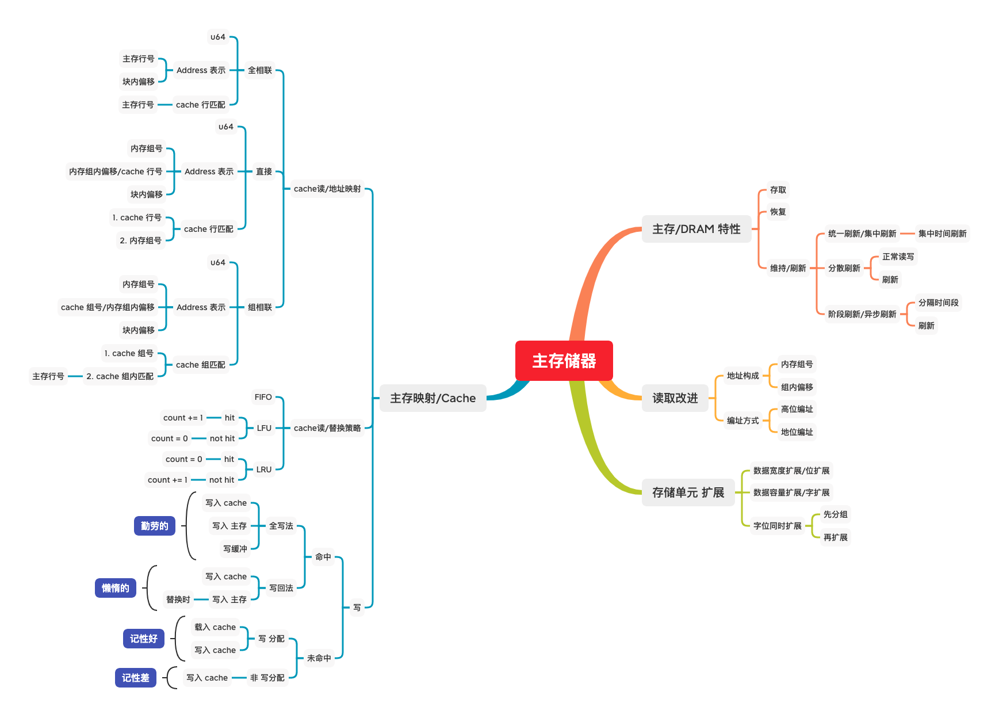
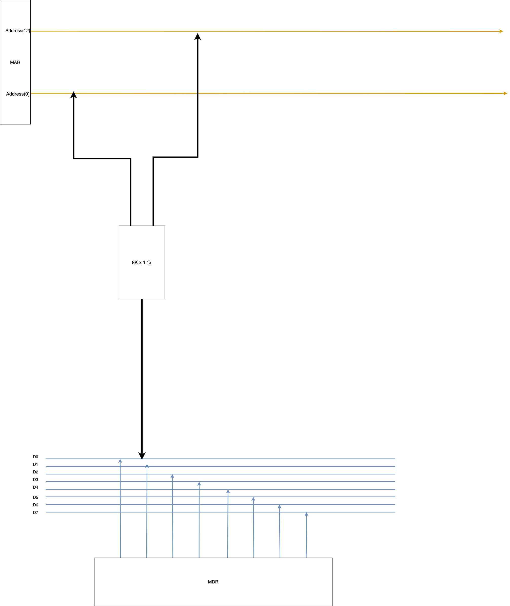
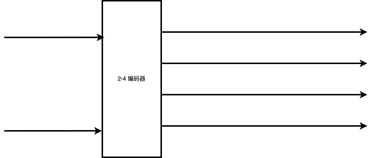
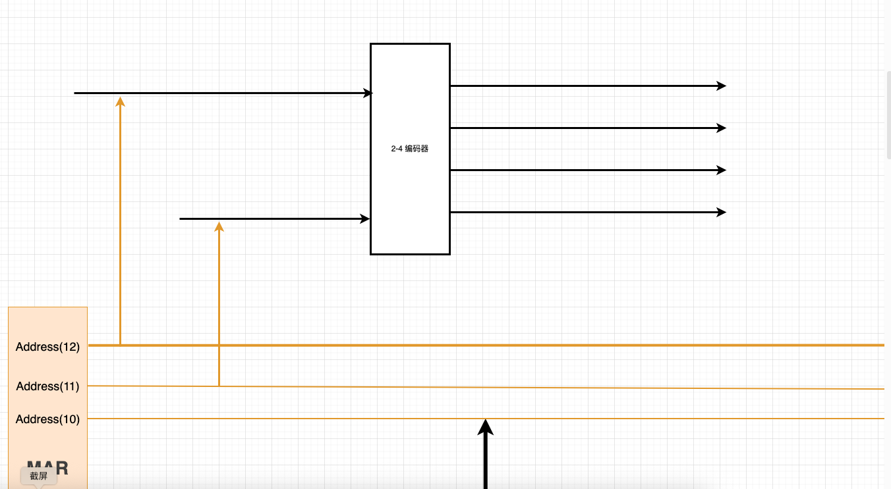
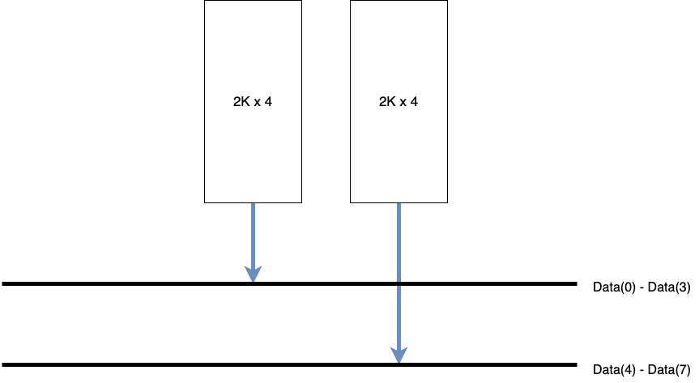
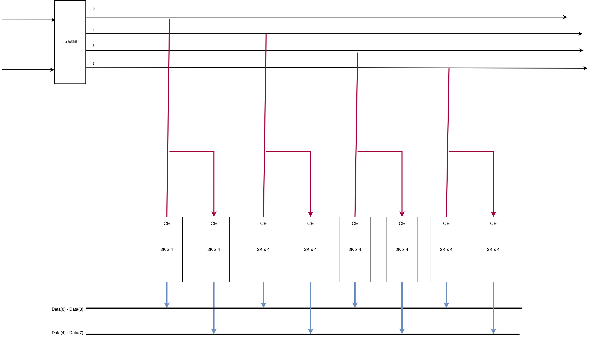

# 主存储器



主存储器，特指内存这个东西，一般我们会在 硬盘中 持久化存储程序，在使用时将 程序 载入内存，再由CPU从内存中提取程序 进行执行

内存可以看作 一行又一行 的内存单元构成，  


## DRAM 硬件特性

主存由 DRAM，即动态 随机访问存储 构成，叫做动态，是因为他的存储特性不太稳定，不能够像 SRAM(静态 RAM) 那样，读取数据后，原先数据保持不变  
而是读取后，原先存储的电容会释放掉电荷，导致存储实效，所以每次读取时都需要恢复数据  
并且，电荷只能维持一定时间的电荷，无论是否断电，都会失去数据，需要隔一段时间进行刷新，才能保持数据正确

我们这样描述 刷新/恢复 行为

1. 一行读完，就要对这行进行恢复，期间不能再对其进行访问
2. 就算什么也不做，也要对其进行恢复，期间不能再对其进行访问

每次读完都要 对内存块 进行数据恢复，这里的电路有点复杂，不做讨论，只需要知道有这个东西就行  
并且我们注意到，读完一次后，又会进行一次写操作，为了方便讨论，我们干脆将 读的时间 和 写的时间合并在一起讨论，叫做 读写周期
___
再来探讨刷新的情况  

我们 **刷新一行** 数据，其实就是读出这一行的数据，再通过硬件重新写入  
每次 **刷新一行** 数据，也就是对一行进行了一次读写数据，耗费的时间和 **一行的读写周期一致**

现在有个排列 128x128 的DRAM内存，他只能维持电荷 $2ms$，对其一行进行读写需要 $0.5\mu s$，也就是说，在电荷保持的时间内，可以进行 4000 次读写  
而我们的任务是，在4000个周期内 对所有行都刷新一遍
我们讨论下如下三种策略是如何进行刷新的

**分散刷新**/每次读完一行，就刷新一行


在4000个周期内，每两个周期 用作一次读写和一次恢复，在这种情况下不用考虑 行数，但是性能缩水了一半

**集中刷新**/在一个统一的时间内对所有行进行刷新


这个例子中，将刷新时间集中在 4000 个周期后面的 128 个周期，确保对128个行 都进行了一遍刷新  
这种情况下，最后128个周期内不能对内存进行访问，好在利用率比第一种方式高出一截

**异步刷新**/隔一段时间刷新一次  
既然要刷新，我们只需要在规定时间内，每一行都要考虑到刷新一遍就行了  
在这个例子中，我们需要在 4000 个周期刷新 128 次即可，而 $4000/128$ 约为 $31$  
也就是说，我们只需要在每 31 个周期中 抽出一个周期 对一行进行刷新 即可


## DRAM 内存读写改进

上述章节，我们知道了对内存进行一次读写，都要进行一次 恢复/刷新，如果这个恢复时间过长，会拖慢整个过程

一般的内存都是单体多字，即只有一个存储体，其中有多行，每行可以存储多个字，依旧是这张图，可以表示这种情况


我们都是一行一行的读取，这里内存地址由 内存行号 和 行内偏移 构成

```rust
struct Address {
    offset_of_line: usize,
    offset_in_line: usize
}
```

现在我们采用多体并行的存储器，即有多个存储体，每个存储体有多行，每行可以存储多个字


现在地址由 内存组号，内存行号 和 行内偏移 构成

```rust
struct Address {
    group_number: usize,
    offset_of_line: usize,
    offset_in_line: usize
}
```

由于我们要访问的是 某一组的某一行，读取到某一行后，我们才会用行内偏移 读取到具体数据，所以我们先不考虑 行内偏移，暂且将地址结构序列化成 **内存组号|内存行号**

在这种地址结构下，当我们需要读到一个连续地址，比如数组时，我们用到地址可以是

1. **0** 1，第0组内存的第1行
2. **0** 2，第0组内存的第2行
3. **0** 3，第0组内存的第3行
4. **0** 4，第0组内存的第4行

可以看出，我们需要访问 第 **0** 组的内存一共4次，当 我们 长期访问 一组内存时，虽然有概率会碰到某行刷新的情况  
但是，如果这个数组元素都在内存的一行中呢？那么每访问一次，都要恢复一次，访问速度会因为 恢复时间太长，太频繁 而拖慢

那我们更改下地址结构的序列化为 **内存行号|内存组号**  
再次访问数组时，用到的地址为

1. **0** 1，第1组内存的第0行
2. **0** 2，第2组内存的第0行
3. **0** 3，第3组内存的第0行
4. **0** 4，第4组内存的第0行

可以看到，对同一组内存的多次访问 变为了 对多组内存的接连访问，访问完一组内存后，跳到另一组内存中，原来的内存行由硬件进行恢复， 大大降低了 被拖慢的概率

上面，我们以 内存组号 为准，将内存组号放在前面的地址结构，称为 **高位编址**，将内存组号放在后面的地址结构，称为 **低位编址**

## DRAM 内存芯片 排列扩展

假设我们只有一个型号的DRAM芯片，他的容量是 8KB，并且每次输出一个数据，即 **8K x 1**  
要对这个芯片进行寻址，需要13位地址总线($8KB = 2^3 \times 2^{10}B, 10+3 = 13$)，那么 **MAR** 的容量是13位  
倘若此时 数据总线有 8 位，那么 MDR 为8位  
将一个芯片接入时  


我们发现数据总线没有充分利用，需要8个芯片 才能充分利用数据总线，，那我们这样接线  


这种针对 MDR/数据总线 的排列扩展 叫做 **位扩展**
___
那我们换一种型号的芯片，这种芯片的容量是 2KB，并且每次输出8位数据，刚好匹配数据总线，我们该如何将多个芯片进行排列，使其能最大化存储数据

将一个芯片接入时，我们发现  


虽然数据总线 被充分利用，但是 数据总线还空了 2 条  
由于一个芯片的容量是 $2KB$ ，而 $2KB = 2^1 \times 2^{10}, 10 + 1 = 11$ ，我们无法用11根接线 接满 地址总线

不过我们可以这样做，既然有两条地址总线空余，我们引入一个 **2-4 编码器** ，即输入2条引线，用4条引线中的一个表示输出  


将其两条输入引线接入 地址总线空余的两位，得到  


现在剩余的2条地址引线 能够表示四种不同的 片选，我们拿出4个芯片，并将其与 2-4编码器输出引线 相接，得到  


由于在输出时，2-4编码器输出的四条引线，只有一条是有效的  
还需要在 芯片中添加一个接收 CE(Chip Enable) 片选信号的硬件，这样在在2-4编码器某一条引线输出高电平时，才会找到对应被选中的芯片

这种针对 MAR/地址总线/寻址范围 的排列扩展 叫做 **字扩展**
___

还有一种情况，这种芯片型号的规格能 气死强迫症  
我们已经知道，在这个例子中，数据总线有8位，地址总线有13位  
我们拿出一个容量为 **2KB x 4位** 的芯片，又该如何进行扩展呢？

其实这也简单，我们需要先满足 数据总线，把这个4位数据宽度的芯片 组和成 8位数据宽度的芯片，只需要把第一个芯片接到数据总线的第0到第3位，第二个芯片接到第4到第7位 即可  


再是满足地址总线，由于与上一个例子中的情况相同，我们只画2-4编码器的接线  


这种 同时针对 数据总线和地址总线的扩展 叫做 **字位同时扩展**  
我们先针对数据总线，进行编组，再针对 地址总线进行扩展

## cache

见 [cache](./cache.md)