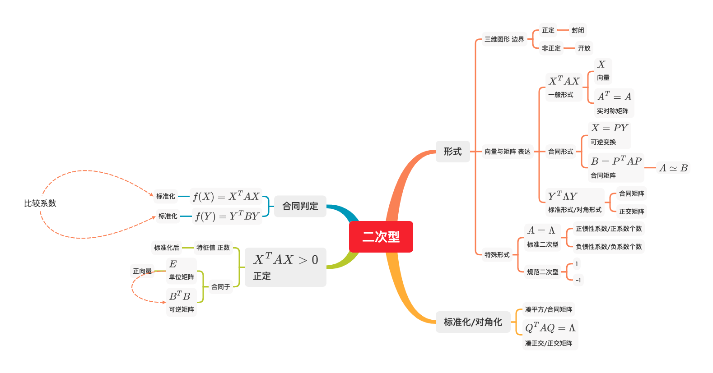
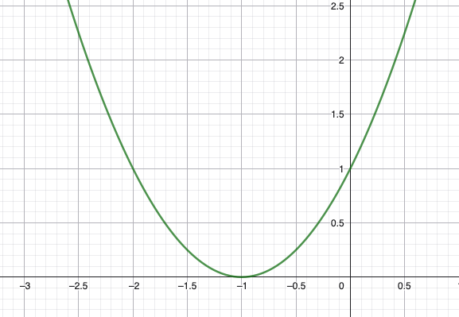
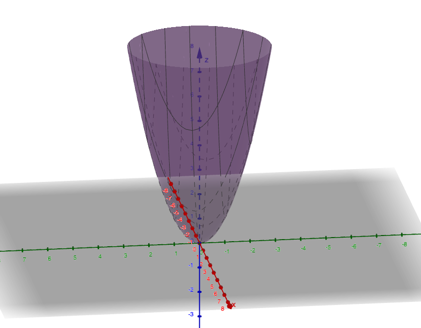
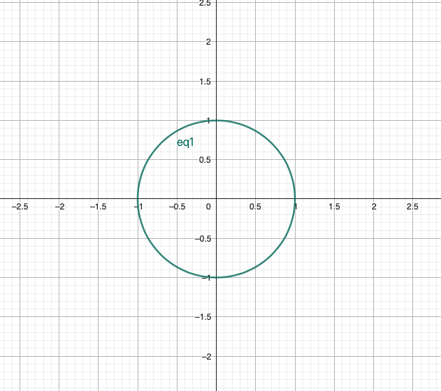
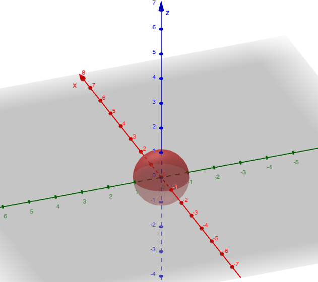
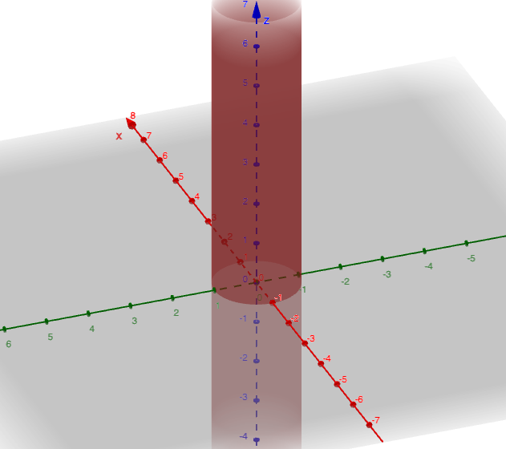
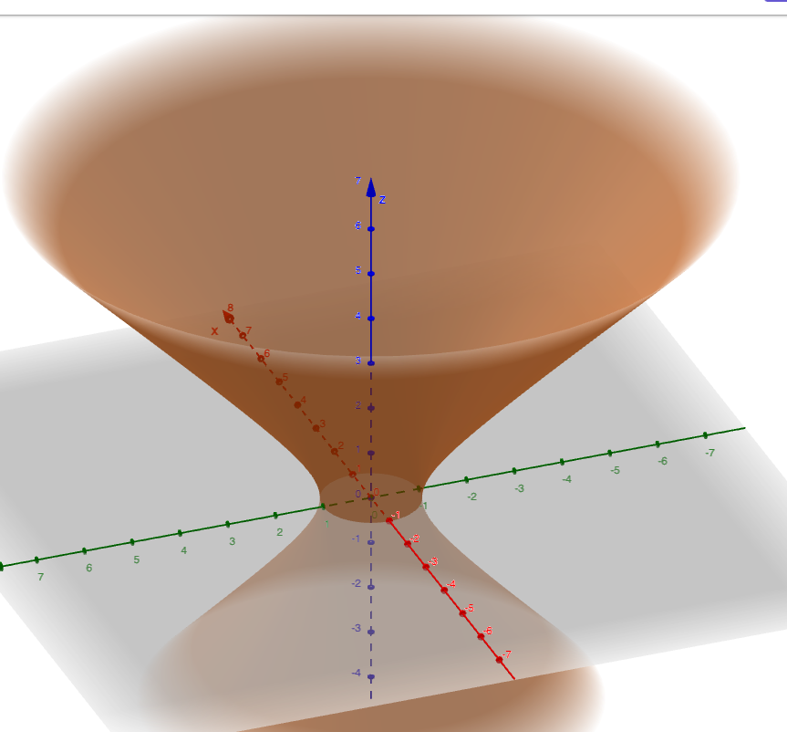

# 二次型

## 二次型的概念

假如一个多项式的项数都是2，如
$$
\begin{aligned}
&f(x) = x^2& \\
&f(x, y) = x^2 + y^2 + 2xy& \\
&f(x, y, z) = x^2 + y^2 + z^2 +2xy + 2xz + 2yz&
\end{aligned}
$$
这些都可以算是二次型，并且我们发现，我们可以用 **向量** 表示函数的输入，用 **实对称矩阵** 表示系数

比如，对于二次型
$$
f(x_1, x_2, x_3) = a_1x_1^2 + a_2x_2^2 + a_3x_3^2 + a_4x_1x_2 + 2a_5x_2x_3
$$
我们使
$$
\begin{aligned}
&X = [x_1, x_2, x_3]^T& \\
&A = \begin{bmatrix}
a_1 & \frac{1}{2} a_4&0 \\
\frac{1}{2} a_4 & a_2 & a_5\\
0& a_5& a_3
\end{bmatrix}&
\end{aligned}
$$
从而使得
$$
f(X) = X^TAX
$$

至此，我们得出结论

1. 从 **代数的角度**去看，二次型 用 **向量** 和 **实对称矩阵** 去描述一个项数都是2的多项式
2. 从函数映射的角度去看
    - 矩阵，向量组，相似矩阵，特征值和特征向量这些都可以用  
$f(向量) \to 向量$ 去描述  
    - 而二次型可以用  
    $f(向量) \to 数值$ 去描述

## 二次型的形式

### 合同形式

我们已经知道，二次型可以用 $f(X) = X^TAX$ ，其中使用了 向量 $X$ 和 实对称矩阵 $A^T=A$ 来表示

如果我们用另一个向量 $Y$ 来描述，并且 $X$ 是 $Y$ 经过 **可逆变换** 得来的
$$
\begin{aligned}
&A^T=A&\\
&X = PY& \\
&\text{det(P)} \ne 0&
\end{aligned}
$$
我们得到
$$
X^TAX = (PY)^TA(PY) = Y^T(P^TAP)Y
$$
我们使 $P^TAP = B$，并称这种关系为 **合同** ，记为 $A \simeq B$  
于是，我们也可以用 向量 $Y$ 和 合同矩阵 $B$ 来表示 二次型

### 对角形式

**我们知道，实对称矩阵一定能相似对角化** ，有
$$
Q^TAQ = \Lambda = diag(\lambda_1, \lambda_2, \dots, \lambda_n)
$$

其中 $Q$ 为正交矩阵，$\lambda$ 为 $A$ 得特征值  
于是我们也可以用 向量 $Y = QX$ 和 对角矩阵 $\Lambda$ 来表示二次型，这种形式叫做 **标准化二次型**

如果我们对正交矩阵 $Q$ 进行单位化，我们就得到 系数只有 $1, -1, 0$ 的矩阵$Q_2$，我们用 向量 $Y = Q_2X$ 和 单位化的 $\Lambda$ 来表示二次型，这种形式叫做 **规范化二次型**

## 二次型形式变换

### 合同矩阵与合同判定

我们已经知道了合同的定义为 $P^TAP = B$ ，但是如何求这个 $P$ 很难，我们该如何判断 $A \simeq B$ 呢？  
我们知道，$A$ 和 $B$ 都是 **实对称矩阵** ，而
> 实对称矩阵一定能够对角化

于是我们可以将
$$
\begin{aligned}
&A \to \Lambda_a = diag(\lambda_a(1), \lambda_a(2), \dots, \lambda_a(n))&\\
&B \to \Lambda_b = diag(\lambda_b(1), \lambda_b(2), \dots, \lambda_b(n))&
\end{aligned}
$$

我们只要比较 $A$ 与 $B$ 特征值中正数，负数和 0 的 **个数** 和 **顺序** 就可以判断 $A$ 与 $B$ 是否合同  
如果 **顺序** 不匹配呢？其实也可以，其实我们是在找一个 矩阵 $P$ 使得 $P^T\Lambda_a P=\Lambda_b$  
假设
$$
\begin{aligned}
&\Lambda_b = \begin{bmatrix}
2 & 0 & 0 \\
0 & -3 & 0 \\
0 & 0 & 1 
\end{bmatrix}& \\

&\Lambda_b \xrightarrow{规范化} \begin{bmatrix}
1 &0 &0 \\
0 &-1&0 \\
0 &0&1
\end{bmatrix} = \Lambda_b' &
\end{aligned}
$$
且
$$
\begin{aligned}
&\Lambda_a = \begin{bmatrix}
2 & 0 &0 \\
0 & 1 &0 \\
0 & 0 &-1
\end{bmatrix}&\\
&\Lambda_a \xrightarrow{规范化} \begin{bmatrix}
1 & 0 & 0 \\
0 & 1 & 0 \\
0 & 0 & -1
\end{bmatrix} = \Lambda_a'&
\end{aligned}
$$

我们发现，$\Lambda_a'$ 变换称 $\Lambda_b'$ 可以看作

1. 先将 $\Lambda_a'$ 第二列和第三列交换
2. 再将 结果 第二行和第三行交换

我们不知道 行变换如何操作，也不知道列变换如何操作，目前只知道 对单位矩阵 $E = diag(1, 1, 1)$ 交换第二列和第三列后是
$$
E' = \begin{bmatrix}
1 & 0 & 0 \\
0 & 0 & 1 \\
0 & 1 & 0
\end{bmatrix} = P
$$
并且
$$
\Lambda_a' P = \begin{bmatrix}
1 & 0 & 0 \\
0 & 0 &1 \\
0 & -1 &0
\end{bmatrix}
$$
将$P$转置后
$$
P^T = P = \begin{bmatrix}
1 & 0 & 0 \\
0 & 0 & 1 \\
0 & 1 & 0
\end{bmatrix}
$$
并且
$$
P^T\Lambda_a'P = \begin{bmatrix}
1 & 0 &0 \\
0 &-1&0\\
0 & 0 &1
\end{bmatrix} = \Lambda_b'
$$
刚好证明，真是瞎猫碰上死耗子  
并且，我们可以得出，对于矩阵 **行列变换** 来说，假如有一个置换矩阵，

1. 放在右边会改变列
2. 放在左边会改变行

而行列变换 也可以看作一种 合同变换

由此可见，二次型 合同的判定 跟特征值出现的顺序 完全没有关系

### 标准化

标准化，就是将 二次型中的矩阵 变为对角阵

我们已经知道，对于实对称矩阵 $A^T=A$ 肯定有 正交矩阵$Q^TQ=E$ 使得
$$
Q^TAQ = \Lambda = diag(\lambda_1, \lambda_2, \dots, \lambda_n)
$$

从而使二次型 $f(X) = X^TAX$ 可以表示为 $f(Y) = Y^T\Lambda Y$ ，其中 $X = QY$
___
以上是从 矩阵的视角看出的，我们再用数字计算的视角 将二次型展开看看
$$
f(X) = f(x_1, x_2, x_3) = x_1^2 + 2x_2^2 + x_3^2 - 2x_1x_2
$$
将其凑个平方，可得
$$
f(X) = (x_1 - x_2)^2 + x_2^2 + x_3^2
$$
刚好符合 标准化二次型 的定义  
我们就可以使用 $X = PY$ 来解个线性方程组就可以 得出向量 $Y$ 和 矩阵 $P$ ，从而得出 合同矩阵 $B = P^TAP$ 了，不过这个 $B$ 可能和 $A$ 的特征值没有关系

## 正定的概念与正定的判定

正定，根据概念，对于任意向量 $X$(其中不包括 零向量) ，都有
$$
f(X) = X^TAX > 0
$$
那么我们就说这个二次型正定

如果我们将一个二次型展开
$$
f_1(X) = x_1^2 + x_2^2 + x_3^2
$$
毋庸置疑，肯定大于0，是正定二次型，其中 **特征值全都大于0**  
如果我们展开的是这个
$$
f_2(X) = x_1^2 + x_2^2 - x_3^2
$$
不一定大于0，不是正定二次型，其中 **特征值中有负数**  
如果 **特征值中有 0** 呢？
$$
f_3(X) = x_1^2 + x_2^2
$$
但是我们发现，对于 $x_1 = 0, x_2 = 0$ 的情况下，任意 $x_3$ 取值 二次型 的值都是 0，与定义不符

我们得出第一个结论: 正定时，矩阵 $A$ 的特征值全为正数
___
我们说过很多遍，实对称矩阵 $A$ 肯定能进行 相似对角化，得到 $\Lambda$  
我们还推导出，正定需要 $A$ 的特征值全为正数，那么经过 相似对角化，$\Lambda$ 中全都是正数，规范化后 可以得出 **单位向量** $E$，其中
$$
E = diag(1,1,1,\dots,1)
$$
都为正数

我们得出第二个结论，正定 需要 $A \simeq E$
___
我们已经知道，正定需要 $A \simeq E$，根据定义，有
$$
P^TAP = E
$$
经过变换，得到
$$
A = (P^T)^{-1}EP^{-1} = (P^T)^{-1}P^{-1} = (P^{-1})^TP^{-1}
$$
我们另
$$
D = P^{-1}
$$
使得
$$
A = D^TD
$$

由此，我们得出结论，正定时，需要 可逆矩阵 $D$，使得
$$
A = D^TD
$$

## 补充 用图像解释正定

### 图像引入

我们知道，在二维空间 (x-y坐标系) 中，有函数
$$
y = f(x) = x^2 + 2x + 1
$$
他的图像是

而在三维空间(x-y-z 坐标系) 中，有函数
$$
z = f(x, y) = x^2 + y^2
$$

我们用 2-dimension 向量描述输入，用矩阵来描述系数，有
$$
\begin{aligned}
&X = (x_1, x_2)&\\
&A = \begin{bmatrix}
1 & \\
& 1 \\
\end{bmatrix}&\\

&f(X) = X^TAX&
\end{aligned}
$$

依此类推，在四维空间中，我们用 3-dimension 向量描述输入，用矩阵描述系数，那么函数
$$
w = f(x, y, z) = x^2 + y^2 + z^2
$$
可以描述为
$$
\begin{aligned}
&X = (x_1, x_2, x_3)&\\
&A = \begin{bmatrix}
1 & & \\
& 1 & \\
& & 1 \\
\end{bmatrix}&\\

&f(X) = X^TAX&
\end{aligned}
$$
___
对于 **二维向量** 描述的 $f(x, y) = x^2 + y^2$ ，他表示的图像虽然是3维的，如果我们使他等于 $1$ ，并在二维空间中去看，发现
$$
x^2 + y^2 = 1
$$
的图像为

那对于 **三维向量** 描述的 $w = f(x, y, z) = x^2 + y^2 + z^2$，他表示的图像是4维的，我们使他等于 $1$ ，并在三维空间中去看，发现
$$
w = x^2 + y^2 + z^2 = 1
$$
的图像是

我们接下来就探讨 $f(x, y, z) = 1$ 时的情况，从而探讨 **正定** 这个东西

### 特征值 对正定的影响

我们知道，二次型 $X^TAX$ 的充分必要条件是 矩阵$A$ 的特征值全为正数，我们先看看特征值全为 正数时是什么情况

对于表达式 $x_1^2 + x_2^2 + x_3^2 = 1$ 可以表述为 $X^TAX$，其中
$$
A = \begin{bmatrix}
1 & & \\
& 1  & \\
& & 1 \\
\end{bmatrix}
$$
图像为

___
我们在看看 特征值 有一个为 0 时是什么情况  
对于表达式 $x_1^2 + x_2^2 = 1$ 可以表述为 $X^TAX$，其中
$$
A = \begin{bmatrix}
1 & & \\
& 1 & \\
& & 0 \\
\end{bmatrix}
$$
图像为

___
最后看看 特征值 有一个为 -1 时是什么情况  
对于表达式 $x_1^2 + x_2^2 - x_3^2 = 1$ 可以表述为 $X^TAX$，其中
$$
A = \begin{bmatrix}
1 & & \\
& 1 & \\
& & -1 \\
\end{bmatrix}
$$
图像为

___
至此我们知道，在图像中，正定就是一个球或者一个杯子，他能兜住水，非正定就是说 他兜不住水

**注意**
在上述例子中，对于 函数
$$
w = f(x, y, z)
$$
实际上他是四维函数，且 $x^2 + y^2 +z^2 = 1$ 是这三个参数的限制