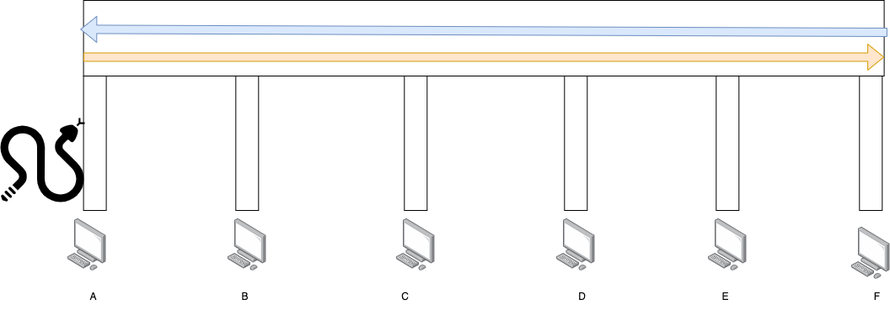
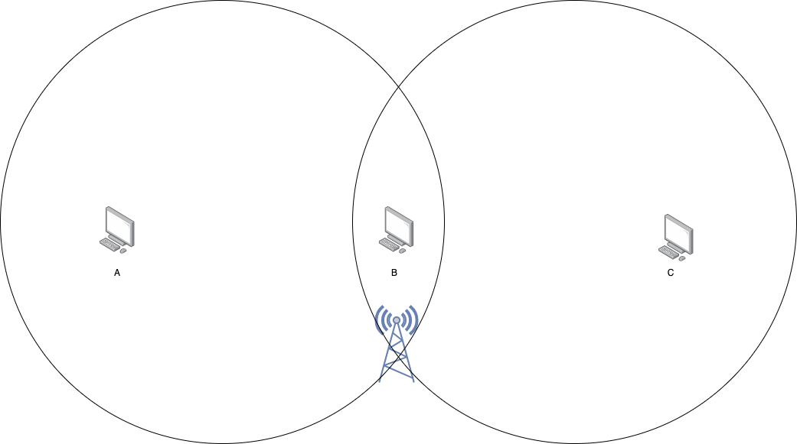

# 介质访问

## 1. CSMA/CD

虽然 交换机的出现已经把这种 总线型以太网 淘汰了，但是这个知识点考试还是会考，需要注意



上图中，如果主机要发送数据到其他主机，数据流就像是一条 **蛇**，总线就像是一条 **管道**  
在 某一端的主机 发送数据/往管道里放蛇 的时候，其他主机不能发数据，怕有冲突  
在蛇 在 **整个管道** 里走一个来回 $2\tau$ 后，管道里才有机会空闲，其他主机才有机会发送数据，由此我们得出一个主机发送数据时的占用时间(**争用期**)为
$$
2\tau = 2 \times \frac{\text{length(pipe)}}{\text{speed(传输介质)}}
$$

并且，我们还发现，如果蛇太短了，主机放蛇之后就失去了对它的控制，需要让蛇的长度(**帧的长度**)刚好充满整个管道，计算得出
$$
\text{length(frame)} = \tau \times \text{speed(数据传输速率)}
$$
这就是 **最小帧长**  
考虑到各个主机之间都要公平对待，都有机会发数据，因此协议中会规定一个 **最大帧长**

___
好的，上述我们讨论了一些概念，这里再探讨总线上各个主机的行为  
在需要发送数据时，主机会监听信道，**一有空闲** 马上发送，其他主机发现没有空闲时，会一直监听直到 信道空闲，再发送

但是我们要知道，碰撞检测不是一定能检测到所有碰撞的，如果有碰撞发生，主机的数据链路层会再次尝试发送数据，直到判定网络出现故障，并汇报给主机程序  
如果检测到碰撞，需要退避 $t$ 时间后，再次监听，其中
$$
\begin{aligned}
&t = 2\tau \times \{0, 1, 3, \dots, 2^k - 1\}& \\
&k = \text{min}(\text{retry}, 10)& \\
\end{aligned}
$$
每次退避，$\text{retry}$ 都会自增

## 2. CSMA/CA

这是给无线网络的 随机介质访问，由于 无线网络的物理性质，随着距离的扩大，信号衰减幅度会更大，远超过有线网络，使得无法有效检测碰撞  
因此，这个协议主要是为了 **Avoidence** 避免碰撞，而不是 **Detection** 检测碰撞

为了尽量避免碰撞产生，协议规定，在发送数据前，都要等待 **DIFS** 时间，高优先级数据 只需等待 **SIFS** 时间  
这个等待时间，不仅是为了尽量避免碰撞，由于无线信号容易被干扰，给出一定时间 可以用作 **差错检测**  
同时，这种容易被干扰的信道 不适合 GBN 和 选择重传协议，因此在协议中使用 **停止-等待** 协议，尽量保证数据可靠

当 接收端 检测到 数据报有错误时，对这个数据报 不进行处理，也不发送 ACK，发送端没有接收到 ACK，判定数据报 超时，进行 **超时重传**，不过这个重传 也要先等待 **DIFS**


___
在需要发送数据时

1. 若主机检测到 信道空闲，等待 **DIFS** 后，再发送
2. 若主机检测到 信道不空闲，需要使用 **CA** 的退避算法，退避完成后，再发送数据

**CA** 的退避算法，具体为

1. 设置一个 随机退避时间 $duration$
2. 监听信道，信道为空闲时，$duration$ 启动倒计时

```kotlin
var duration: Int = ...
while (true) {
    if (duration == 0) {
        break // 退避完成
    }

    if (isSpace) { // 如果空闲
        duration -= 1
    }
}
```

由于检测不到碰撞，各个主机之间 通过 数据报 **超时** 来判定有 **碰撞或差错产生**

___
由于无法检测到碰撞，不能像 有线总线型网络 中那样能够检测到所有主机的碰撞，会出现 **隐蔽站** 的问题，协议中给出了 **预约** 的解决方法，即

1. 主机要发送数据前，根据协议先等待 **DIFS** ，再发送 **RTS (Request To Send)** 帧
2. 无线接入点(AP) 准备好接收后，准备**广播** 高优先级的 **CTS (Clear To Send)** 帧，根据协议 等待 **SIFS** 时间
3. RTS 告诉 AP 谁要进行数据传输，和传输的时间
4. CTS 告诉 网络中的所有节点，谁要进行数据传输 和 其占用时间，其他节点 在这个占用时间内不要对 AP 有访问

**补充**  
协议中有三种 IFS (inter-frame space，帧间隔)，其中有

1. **DIFS** Distributed Inter Frame Space，最长的IFS
2. **PIFS** Point Inter Frame Space，中等长度 IFS
3. **SIFS** Short Inter Frame Space，最短的IFS

**SIFS** 用作高优先的帧，有

1. CTS
2. ACK
3. 对 AP 的应答帧
4. 分片后的数据帧/尽快处理完

并且，信道中的节点争取到 争用窗口后，为了保证数据连贯性，都会等待 SIFS 后，传输数据

**再次补充**  
CSMA/CA 中没有规定 最小帧长 和 最大帧长
