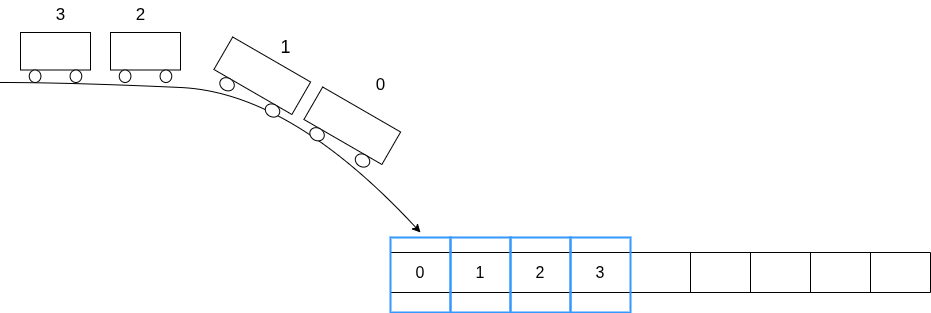
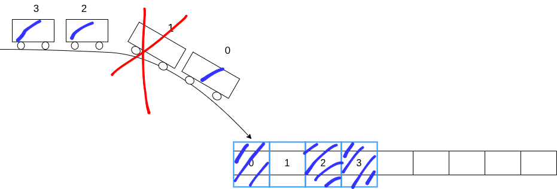
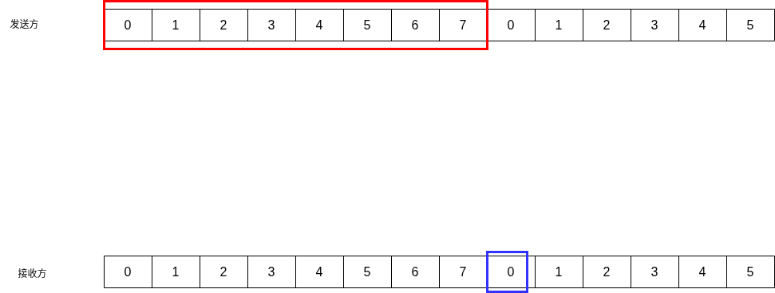
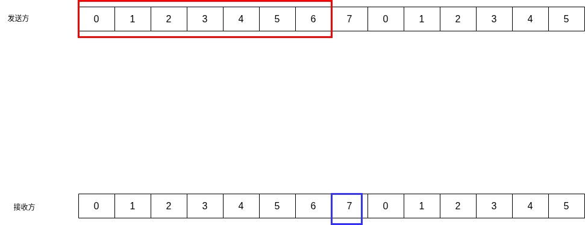
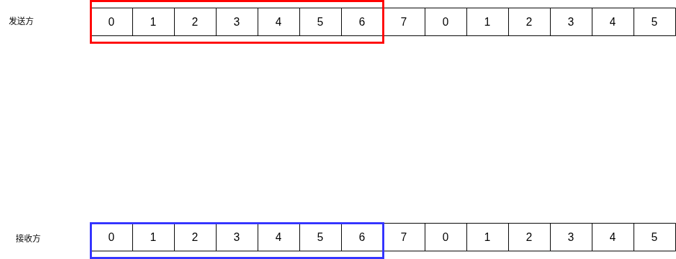
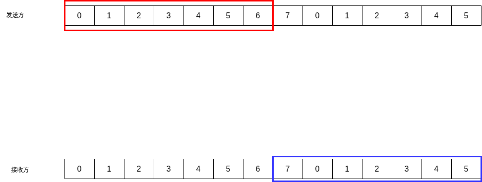
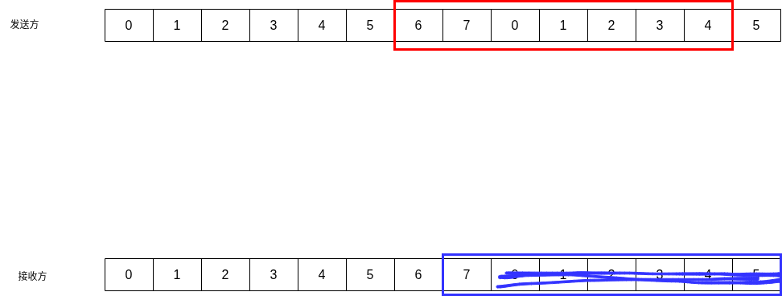
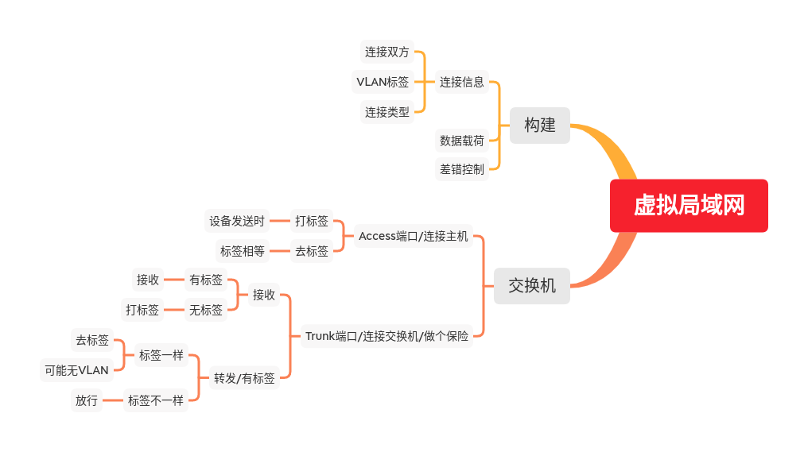
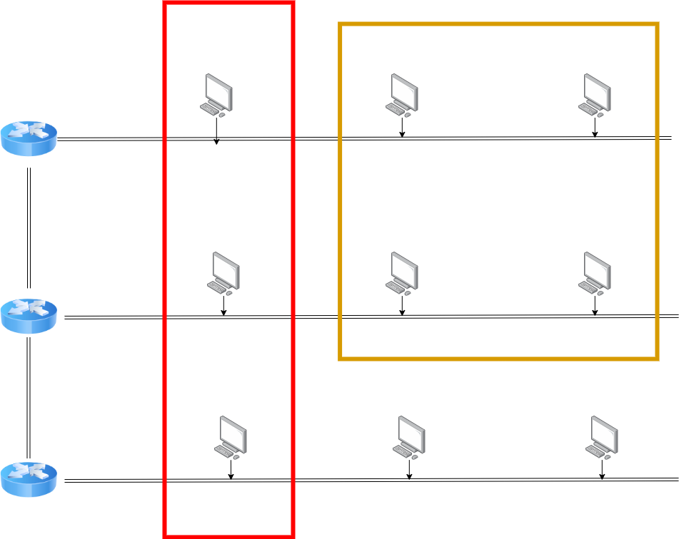
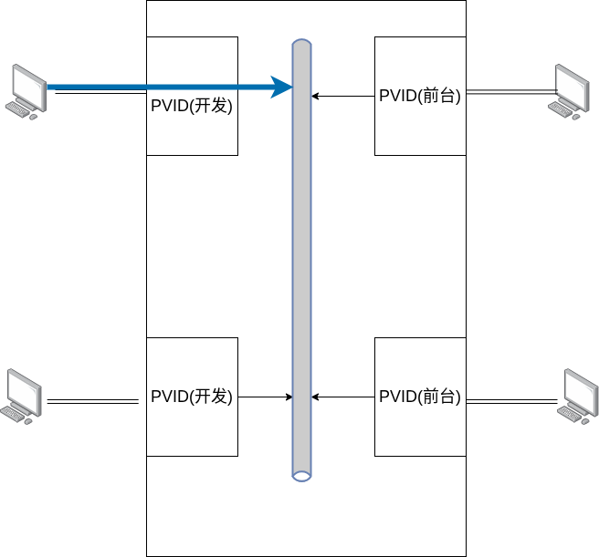

# 数据链路层


## 介绍

数据链路层 介于 网络层 与 物理层之间，网络层 就像是 一条路线的两端，而数据链路层就像是 路线中的各个站点  
我们知道网络层的IP数据报有差错检测，而数据链路帧也有差错检测，其实这不会冲突  
IP数据报的差错检测 对象是 发送方 和 接收方 两端，而数据链路帧的差错检测是 中转的各个站点之间

在整个网络数据传送途中，源IP地址和目的IP地址是不会变的，而源MAC地址和目的MAC地址可能会有多次变化  
网络层之间传输使用的是 IP数据帧，而数据链路层对IP数据帧包装成MAC帧，在各站点之间进行传输，层层转手

___

我们换成 货运公司 的视角，我们作为一个卡车司机，需要将我们的货物，也就是IP数据报传输到 目的地，但是我们有严格的8小时工作制，所以我们用 换人不换车 的方式，从一个站点送到另一个站点后，由这个站点的人进行 接力，并进行一系列交接事宜(差错检测) ，由这个站点的人将车开到下一个站点(下一个MAC地址)，直到运输到 接收端
___

我们重新整理下整个过程，假设我们是长途冷链运输公司 的司机，这一天公司接单一份单子

1. 接单/封装成帧  
公司接到单子，知道了 下一个站点的信息(连接信息) 和 交接仓库类型(连接类型) 后，还需要 检测 这批货物 是否合格，是否通过防疫标准(计算差错校验位)，检测合格后，将 **货物** 和 **合格证书** 一起装货
2. 组帧/装货  
接着，公司安排人手 将货物搬运到 **半挂卡车** 的拖车上(组帧)，由我们进行运输任务，将车开到下一个站点
3. 下一个站点，差错检测  
我们将半挂卡车开到下一个站点，进行交接和检查
    - 如果检查到有异常状况，原来的拖车会被直接销毁，我们将半挂开回去，重新再运一遍
    - 如果没有异常状况，由这个站点接收这个单子，并由这个站点的半挂车司机，将拖车带着其货物 运输到下一个站点  
    并且 我们告诉自己的公司，这批货物已经完成交接

在早期运输过程中，我们这些司机 都挤占在一条线路上，还要避免撞车，极其拥堵，详见 介质访问  
到了现在，都是使用专用通道，快速高效

本来公司是只有一位司机进行 运输任务，但是后来任务颇多，需要添加人手，组成一个车队去传输，虽然运输效率变高了，但是对方站点忙不过来，需要一点手段来实现 双方的可靠传输，从而避免 数据出错，详见可靠传输

## 接单/封装成帧

数据链路层 会将 来自网络层的IP数据报进行封装，在 **帧头** 有

1. 目的 MAC 地址
2. 源 MAC 地址
3. 类型  
这个类型是指要交给 网络层的哪个服务协议，可以是 IP协议，也可以是 地址解析协议

在 **帧尾** 会添上 差错控制 位，通常使用 CRC 进行计算


注意到，途中有个叫 前导码 的东西，其中包含了 7个字节的 前同步码 和 1个字节的帧开始定界符  
前同步码 是 1 和 0 相互交替，到了 帧开始定界符 都是 1 和 0 交替，最后突然变成 11，这 1 和 0 相互交替 是与目标节点的时钟相互同步，告诉目标后续有数据要发送，两边时钟协调一致后，马上传送 11，开始传送数据  
在我们这个比喻中，就像是 公司提醒 客户，我们已经装好货物，请及时查收
___

实际上，封装成帧 的细节会根据 有线网络 和 无线网络 的性质有稍许不同，具体表现在帧的结构上  
上面的例子中，我们讨论的是 有线网络 的帧结构

```rust
enum ServiceType {
    IPv4,
    IPv6,
    ARP,
    RARP
}

struct Frame {
    address_target_mac: [u8; 6], // MAC 地址有48位
    address_source_mac: [u8; 6],
    service_type: ServiceType,
    ip_datagram: IPDatagram,
    fcs: u32 // 4个字节，32位二进制数，也可以写 [u8; 4]
}
```

但在 **无线网络** 中，由于其信号衰减幅度极大，极容易收到干扰，帧的结构会更复杂一些  
为了最大程度的可靠传输，无线网络中有中转站的存在，就像中继器一样，可以接力传输到另一端  
无线网 帧的一部分扩展就是针对这个中转站，有字段

1. 中转站地址，这个放在 **地址一** 字段  
剩下的 源地址放在 地址二，目的地址放在 地址三
2. FromAP 位  
标识这个帧 是来自 中转AP 的
3. ToAP 位  
标识这个帧 是传给 中转AP 的


我们描述下关键结构

```rust
enum FrameType {
    Manage,
    Control,
    Data
}

enum FrameSubtype {
    Data,
    RequestToSend,
    ClearToSend,
    Acknowledge
}

struct FrameControl {
    frame_type: FrameType,
    subtype: FrameSubtype,
    from_ap: bool,
    to_ap: bool
}

struct Frame {
    frame_control: FrameControl,
    address_ap_mac: [u8; 6],
    address_source_mac: [u8; 6],
    address_target_mac: [u8; 6]
    ip_datagram: IPDatagram
}
```

有线以太网 数据链路层中，需要 一个站点一个站点的传递，也可以看成中转，无线网中，可以看出，中转之中，还有中转

## 装货/组帧

组帧，不如说是对帧的序列化，不是序列化成 JSON 格式，而是 二进制格式  
组帧发生在 发送方，而对应的拆帧 发生在 接收方，两方一个是 序列化，一个是 反序列化，用我们这个 运输公司的逻辑来说，一个是 装货，一个是 卸货  
在组帧的时候一定要确保数据不会出错，一旦出错，接收端 对帧进行反序列化时，得到的完全是错误的数据

在网络发展早期，工程师采用 **字符计数** 的方式来进行组帧，数据由

1. 数据个数
2. 数据

构成，假如一个帧中有数据 `1234` ，加上 数据个数，一共5个数据，那帧将以 `51234` 的形式传输  
我们发现，只要有一个数据出错，后续的数据接连出错，一步错，步步错，这种方法基本不用

后来，工程师们用类似如下的形式来序列化帧

```
begin
    1234
    5678
end
```

用一个特殊的数据表示 `begin` ，即传输开始  
用一个特殊的数据表示 `end` ，即传输结束  
但是我们很快发现一个问题，如果传输的数据中，有和 `begin` 或 `end` 同样格式的数据 该怎么办？  
我们又拿出一个特殊的数据 `esc` 表示 转义，比如在数据中有和 `begin` 或 `end` 相同格式的数据，我们这样序列化数据

```
begin
    esc begin
    esc end
end
```

那如果和 `esc` 相同呢？再加一个 esc

```
begin
    esc esc
end
```

在接收端，这种特殊数据不会作为数据进行处理，这种方式叫做 **首尾定界符法**

目前主流的方式有两个  
一是 **零比特填充法**，加工数据时，如果连续遇到5个1，那就在后面添加一个0  
二是 **违规编码法**，将 1 序列化成 高低电平，将 0 序列化成 低高电平，在接收时，如果发现有 高高电平 或是 低低电平，那就看作违规编码，不做其进行处理  
很明显，这种方法有强大的抗干扰能力，并且序列化方式极其简单

## 清点和交接/差错检测

差错检测 其实有两个阶段  
第一个阶段是 **发送端** 清点货物，确认货物质检合格，并将质检报告和货物一起运输
第二个阶段是 **接收端** 交接货物，再对货物进行一次质检，查看质检报告是否和 发送端 的质检报告相同

质检方式有很多种，我们只讲 奇偶校验，CRC 校验 和 带一定能力纠错的 海明码

### 奇偶校验码

这个方式专门对 1 的个数进行校验  
给定一份二进制数据，现在我们要进行 **奇校验** ，如果数据中1的个数是奇数，我们为数据附加一个0，如果有偶数个1，那我们为数据附加一个1  
如果要进行 **偶校验** ，如果数据中有奇数个1，那就添加一个1，如果有偶数个1，那就加一个0

这种方式的检错能力有限，如果有偶数个错误尝试，无法检出，也不能判断有多少个错误

### CRC 编码

CRC，循环冗余校验码，这个东西的生成需要依靠一个 生成多项式，假设双方 **约定** 生成多项式是
$$
G(x) = x^3 + x^2 + 1
$$
___
发送方要发送 数据 `10111`，他要进行

1. 构造被除数  
已知生成多项式 最高次项为 3，那就在原始数据后面添加 3 个0，构成被除数 `10111000`
2. 构造除数  
生成多项式的 次项系数 一一提取，得到 `1101`，将其作为除数
3. 计算余数/异或  
以往的除法都是用减法，这里我们用异或位运算
4. 拼接原始数据 和 余数，如果余数不够长，在前面填0，直到余数宽度和 生成多项式 的次项相同

我们举几个例子，假设我们要发送  **10111** ，我们需要

1. 构造被除数 为 **10111000**
2. 构造除数为 **1101**
3. 计算余数  
  
发现余数为0，填充，变为 **000**
4. 拼接原始数据和余数，得到 **10111000**

我们再发送 101001 试试

1. 构造被除数 为 **101001000**
2. 构造除数为 **1101**
3. 计算余数  
  
得到余数 1，填充，获得 **001**
4. 拼接原始数据和余数，得到 **101001001**

___
接收方收到数据后，他要进行

1. 构造被除数，这里用 接收到的数据 作为被除数
2. 构造除数，用生成多项式
3. 计算余数，如果余数为0，那就是说没有错误，非零表示有错误

接收方 接收到 **10111000** ，现在

1. 被除数是 **10111000**
2. 除数是 **1101**
3. 计算余数，得到0，说明数据没有出错

### 海明码


假设我们需要传输四位数据，$D_4D_3D_2D_1$  
我们用三位校验位 去校验这四位数据 $P_3P_2P_1$  
我们将 校验位，用位置的高低 排序成
$$
P_3P_2P_1
$$
既然有三位，我们用这三位来表示二进制数 $XXX$ ，其中

1. $P_1$ 表示 $XX1$
2. $P_2$ 表示 $X1X$
3. $P_3$ 表示 $1XX$

我们知道，校验位 不能去校验自身，那么我们

1. 用$P_1$ 去校验第 $5(101b), 7(111b), 3(011b)$ 位
2. 用$P_2$ 去校验第 $3(011b), 7(111b), 6(110b)$ 位
3. 用$P_3$ 去校验第 $5(101b), 6(110b), 7(111b)$ 位

并且我们将

1. $P_1$ 放到 第1位
2. $P_2$ 放到 第2位
3. $P_3$ 放到 第4位

重新排序 数据位 与 校验位
$$
D_4D_3D_2P_3D_1P_2P_1
$$

那又如何计算校验位呢？用异或
$$
\begin{aligned}
&P_1 = H(5) \oplus H(7) \oplus H(3)& \\
&P_2 = H(3) \oplus H(7) \oplus H(6)& \\
&P_3 = H(5) \oplus H(6) \oplus H(7)&
\end{aligned}
$$

___
现在我们对数据 **1010** 提供3个校验位，根据上述过程，我们加工数据，得出发送的数据为

|P(7)|P(6)|P(5)|P(4)|P(3)|P(2)|P(1)|
|:--:|:--:|:--:|:--:|:--:|:--:|:--:|
|D(4)|D(3)|D(2)|P(3)|D(1)|P(2)|P(1)|
|1|0|1|0|0|1|0|

倘若我们收到的数据是 **1110010** ，在这个数据中，第6个数据被篡改了，我们再次计算校验位  
得到

1. $P'(1) = 0$
2. $P'(2) = 0$
3. $P'(3) = 1$

将其分别与 接收数据中的校验位 异或，得到

1. $P'(1) \oplus P(1) = 0$
2. $P'(2) \oplus P(2) = 1$
3. $P'(3) \oplus P(3) = 1$

将其由索引从高到低排列，的到 $110b$，即十进制数6，由此我们发现第6位数据出现了问题，如果要纠错，直接给第6位取反即可

这种 $P' \oplus P$ 我们叫做校验子
___
上述过程中，我们发现，索引都是从1开始的，当 校验子全为0 时表示数据无错，如果不为0，他还有 $2^k-1$ 个取值，他要映射到海明码的所有数据，即 $1 \to n+k$ 的范围，映射范围不能少，只能多，或者刚好，由此有
$$
2^k - 1 \ge n + k
$$

## 运输过程/介质访问

[详见这里](./介质访问.md)

## 车队运输/可靠传输

由于运输时，司机只有我们一个人，需要我们一趟一趟跑，公司决定加派司机，这个时候需要 发送方 与 接收方 保持一定的通讯，从而使得 快速传输的同时，保证数据正确送达  

在讨论这种传输方式的时候，我们需要知道

1. 什么时候装载 下一批货物
2. 接收方，发送方 双方之中可能会出现哪些错误类型
3. 接收方，发送方 双方如何处理错误

其中错误类型有两种

1. 订单超时  
现实中的订单超时指的是 从发送方运输到接收方，在这里指 运输到接收方后，再回到发送方这个过程  
也就是 从数据传输 到 接收到 ACK 这个过程
2. 货物损坏  
指的是 接收方经过差错校验发现这个帧有错误

### 停止-等待

1. 发送窗口: 1
2. 接收窗口: 1

在司机只有一个时，我们使用 **停止等待协议** 在双方之间通信

#### 什么时候装载下一批货物

在发送方与接收方之间，发送方在发送数据后，需要等到接收方确认数据到达后，才进行下一次装载

#### 错误类型与错误处理

在接收方的视角下，货物有可能损坏，也有可能由于超时未及时送到  
在货物损坏时，接收方发送 NAK 否认帧告知 发送方 数据错误  
在没有收到货物时，不会进行处理

在发送方视角下，得知了货物出现损坏时，原来订单的计时被重置，马上组织重发  
如果是订单超时，那就再组织人手发一次

### 回退N帧

1. 发送窗口: n
2. 接收窗口: 1

公司后续会组建一个固定长度的车队，姑且设置长度为 $4$ ，车的编号从 $0$ 到 $4-1=3$  
下一个站点有点窘迫，他们的工作空间极其狭小，一次只能接收 **一辆车** 卸货，并且只能按顺序处理，乱序的车队他们无法处理  

当我们的车队 **按序，准时** 到达时  
  
工作人员先准备0号卡车的卸货，再一次准备1到3号卡车的卸货，有序执行  

#### 什么时候装载下一批货物

每处理完一辆车，这辆车的司机就可以 **逐一** 回去交差了，或是在原地修整后，让编号最大的司机领队，**一起** 回去交差  
在回去途中，其他人丢了/去休假 了也没事，领队的回来就行  
在确认领队回来后，公司立刻组织下一批货物的装载

如果回来的只有一个，是2号，那就是说，0,1,2这三辆车都已经完成了订单，但是无法代表3号完成订单  
不过这不要紧的，我们还有一层保险--订单超时，照样可以检测到错误并做重发处理

#### 错误类型与错误处理

在接收站点中，由于这个站点只能接收顺序数据，他所面对的错误只有一个，那就是 **数据乱序**  
当车队编号乱序时，就会引起错误，而造成乱序的情况有两种

1. **货物损坏**，在运输途中，有辆车的货物有了损坏，站点经过检测后丢弃该车货物
2. **订单超时**，在运输途中，有辆车抛锚了，导致没能在规定时间内到达目的站点，其他车都到了，就他没到

站点事先会现将损坏的货物销毁，导致到达的车队编号不是顺序的  
在卸货时，工作人员还是如往常一样，先把0号车处理了，然后轮到1号车，结果发现1号车不在，来的是2号车，于是工作人员告诉2号车以及后面的司机: "你们的货无效，**回去** 告诉你们老板，先把1号车的货运过来"

2号车，3号车回来之后，都向站点汇报这个错误(多个对1号车的ACK) -- 对方需要1号车的货物  
站点在多个错误汇报后，重新组织一个车队去运输1到3号车的货物  
但是如果到达接收方的车队中，最后一辆车的货物不在处理队列内，又找车队中的谁去发ACK呢？  
其实完全可以静默处理，因为 发送方这里还有个 超时机制，可以进行重发

### 选择重传

1. 发送窗口: n
2. 接收窗口: $\le n$

还是这个车队，我们扩大这个接收站点，使其能接收乱序数据，在上述这种情况下，情况变成  
  

此时，在接收站点内，0号车，2号车，3号车的货物都被正确卸下，他们弄完都可以走了(逐一确认)  
而只有1号车出了状况，可能是 路上抛锚导致超时，也有可能是货物损坏  

#### 什么时候装载下一批货物

很简单，当车队都完成了发送时，组织下一批车队去装载下一批货物

#### 错误类型与错误处理

在接收方视角中，错误不再是数据乱序，而是 **数据缺失**  
此时在图中，我们发现1号车货物缺失，可能是订单超时了，也有可能是货物损坏，被提前丢弃了，这都不重要，接收方等着就行

此时在发送方发现一号车的订单超时了，开始对其进行重传

### 补充: 窗口大小的限制

在上述章节中，我们用组织车队 来比喻一次流水线数据/帧 传输，并对每个数据/帧 进行了编号，这里我们讨论下 编号的作用 和取值  

要知道，帧的编号不是像 数据库表那样进行自增的  
如果编号不断自增，可能需要一个长整形来表示，也就是64位整数，在寸土寸金的帧结构中不是什么好方法  
在实际的应用中，对帧的编号是周期进行的，比如我们在帧上留下3位二进制数用作编号，编号从0-7，周而复始进行编号  
那这是不是意味这 每个车队中的编号都是0-7呢？  
不是的，这个编号主要是用作 接收方识别新旧数据，如果超过一定范围，会导致无法分辨新旧数据，同时这个分辨也受 接收方 窗口大小 影响
___
在GBN协议中，接收方窗口大小只有1，我们姑且设置发送方编号为0-7，用三位二进制数作编号  
当发送方窗口大小为8时，其包含了0-7编号的数据，即所有编号的数据  
而此时接收方的窗口 可以接收 编号0的数据，可以接收编号1的数据，可以接收任意编号的数据  

我们来看这种情况(窗口大小为8)  
接收方已经接收到7号数据，发送对其ACK，并移动窗口，但是 ACK 在途中丢失了  
此时发送方已经发送完第一份编号0-7的数据，但是还没接收到ACK，没有移动窗口


由于没有在规定时间内接收到ACK，发送方判定超时，重发 0-7 号的数据，而接收方已经把窗口移动到下一个0号，准备接收下一个0-7号数据了，这数据完全是错误的

那我们减少一个发送窗口看看(此时窗口大小为7)  
还是上述的情况，不过接收方的窗口已经移动到为7号数据准备  


如果发送方没接收到ACK，判定超时，那就重发 0-6号的数据，而接收方的窗口在7号数据，判断乱序，重复告诉发送方 --- 给我7号数据  
这样就不会产生数据错误了

假设有 $bit$ 位用作表示编号，发送方窗口大小需要满足
$$
1 < \text{window\_size(sender)} \le 2^{bit} - 1
$$
___
在选择重传协议中，情况有稍许不同  
还是用上面的例子，发送方窗口大小为7，但是 接收方窗口是大于1的，不如假设接收方窗口大小也为7，此时  


在接收方移动窗口，但是发送方没有收到ACK，判断超时的时候，有  


此时发送方重发 0-6号的数据，接收方用他们来填充下一组数据  
并且这一次ACK到达了发送方，发送方也对窗口进行了移动  
  
我们发现发送方中的6号数据不再接收窗口的接收范围内，不用怕，此时6号数据会被直接丢弃

此时接收方还有7号数据的位置没有被填充，好在发送方的窗口内已经有了7号数据，完全可以用来填充  
可以看出，整个数据都乱套了，虽然能运行，但是是靠bug运行成功的

我们对发送方窗口进行减小，终于在
$$
1 < \text{window\_size(sender)} \le 2^{bit - 1}
$$

的时候解决了这个问题，同时需要
$$
1 < \text{window\_size(receiver)} \le \text{window\_size(sender)}
$$

### 补充: 窗口的移动

这个东西很好描述，看窗口最左边/开始位置 是否已经接收到 ACK，如果接收到ACK，往前移动一个数据

## 补充: 局域网与虚拟局域网



我们注意到，数据链路层这一章专门讲局域网，这个章节又有一个虚拟局域网，这些好像都和数据链路层没什么关系  
其实这个章节都在讲一件事，如何在局域网中构造 **帧数据**  
而这个东西，我们已经在 装货/封装成帧 这个章节中讨论过了，不再赘述

虚拟局域网又是个什么东西呢？他是为了在 **交换机** 扩展的网络中 **限制广播域** 而设计的，简而言之，就是在 帧 中把自己所属的虚拟局域网ID(即 PVID, Port VLAN ID) 加上去了，这样在广播时，由交换机判断广播帧的 VID 并进行 **选择性转发**  
可以看到，对帧添加VID 也涉及到了 帧 的构造

**交换机治下发送广播**

接下来我们探讨下 虚拟局域网中的广播 是如何受VID影响的

我们有以下 交换机扩展的网络
  
其中黄色的是开发部的IP地址，而红色的是每一楼前台的IP地址  
而每一楼由不同的交换机管理，那交换机又是如何将我们的广播信息传递到对应的广播域呢？

假如一个主机在开发部门的虚拟局域网中，其连接交换机的 PVID 为 `PVID(开发)`  
他在广播时，需要传递到

1. 同一交换机治下 的 连接到 PVID 为 `PVID(开发)` 端口的主机
2. 不同交换机治下 的 连接到 PVID 为 `PVID(开发)` 端口的主机

在 **同一交换机内部**  
  

现在，这个主机发出广播数据，交换机首先会用其连接端口的 PVID，对这个广播帧，其结构可以描述为

```json
{
    frame: frame,
    vid: PVID(开发)
}
```

现在交换机遍历每一个连接主机的端口，查看其 pvid 是否与这个帧的 `vid` 匹配

1. 如果匹配，把标签移除，发给这个端口
2. 如果不匹配，不做处理

接着，交换机将这个打了标签的帧 发到自己的广播域中，也就是说这个广播帧会交给其他交换机处理  
不过在讨论交换机如何处理 接收到的广播帧 之前，我想说一下交换机与交换机之间的端口 也有一个 PVID

**交换机之间发送广播**

我们在讨论虚拟局域网的时候，应该想到，这个虚拟局域网不是必要的，那交换机又该如何让 在虚拟局域网 下的主机 与 不在任何虚拟局域网 下的主机进行数据传输呢？

我们在交换机端口记录PVID是为了支持虚拟局域网，而这个记录是个 **硬件结构** ，他一直在那里，除非你换设备  
那要是这个网络内 不需要虚拟局域网，直接将 PVID 设置成一样的就好了  
在主机发送广播帧时，交换机发现 PVID 一直都是匹配成功的，那这个广播帧可以发送到整个网络中  

而虚拟局域网是 数据链路层的概念，并且是由我们这个网络中的交换机进行处理  
而外部设备通过网络传输数据到 我们这个网络时，是没有 VLAN 标签的  
交换机对这个数据 进行 PVID 解析时肯定会发生错误，因为压根就没有 PVID  
为了避免这种情况，交换机在与其他交换机连接的 **trunk端口** 中也记录了一个 默认 PVID，当这种没有 VLAN 标签的数据 **进来时**，赶紧给他打上 默认标签，防止解析出错

那现在，交换机内有两种端口

1. 与设备之间相连的 **Access 端口**
2. 与交换机之间相连的 **Trunk 端口**

不管哪个端口，都有自己的 PVID，到了 Trunk 端口，只要记住

1. Trunk 端口的 PVID 是专门为了防止对 **外部网络** 发送无VLAN标签的数据 解析出错
2. 在接收外部数据时，有标签的，都可以接收，没标签的，打上标签再接收
3. 在发送内部数据时，数据肯定带着端口的PVID，肯定有标签
    - 当VID 与 trunk 的PVID一致时，判定没有虚拟局域网，去掉标签发送
    - 当VID 与 trunk 的PVID不一致时，判定可能会转发给其他广播域的虚拟局域网，直接转发

___
回到正题，接着探讨交换机如何处理收到的广播帧，在广播帧中，有

```json
{
    frame: frame,
    vid: PVID(开发)
}
```

同样的，二楼的交换机接收到后，遍历每一个 Access 端口，查看其 pvid 是否与这个帧的 `vid` 匹配

1. 如果匹配，把标签移除，发给这个端口
2. 如果不匹配，不做处理

交换机还需要比较 `PVID(开发)` 与 trunk 端口的PVID，如果

1. 相同，去掉标签，转发到其广播域
2. 不同，直接转发到其广播域

一楼的交换机接接收到这个广播帧后，如果发现其没有VLAN标签，会自动给他加上

**再次补充**

交换机在转发帧时，会检查地址是否是来源于自身的，从而避免无限转发

## 补充: 有线以太网MAC帧 的长度 和 无线MAC帧的 长度

由于无线网络的数据可靠性不高，要花比有线网络更多的措施去发送一帧的数据，如果数据长度比较小，那么这个 "路费" 花的不值，干脆一趟多运点货，这也是为什么 无线MAC帧的长度 比 有线MAC帧长度长
