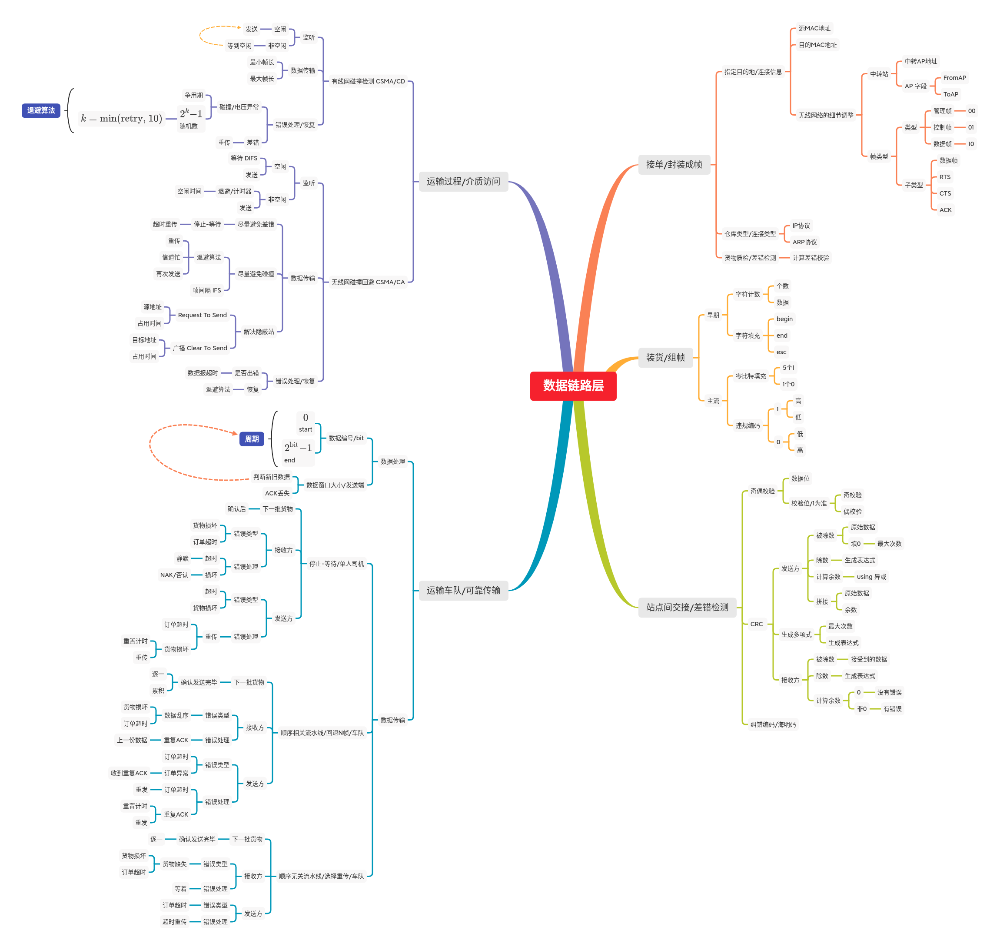
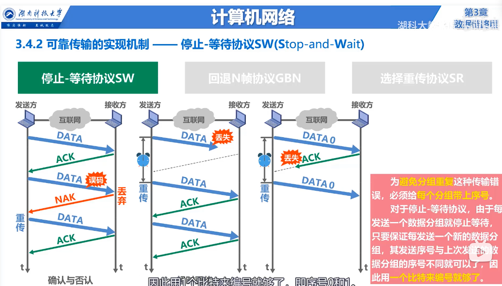
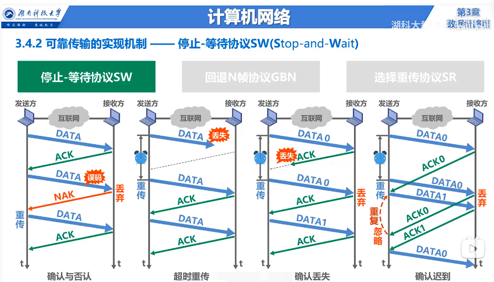
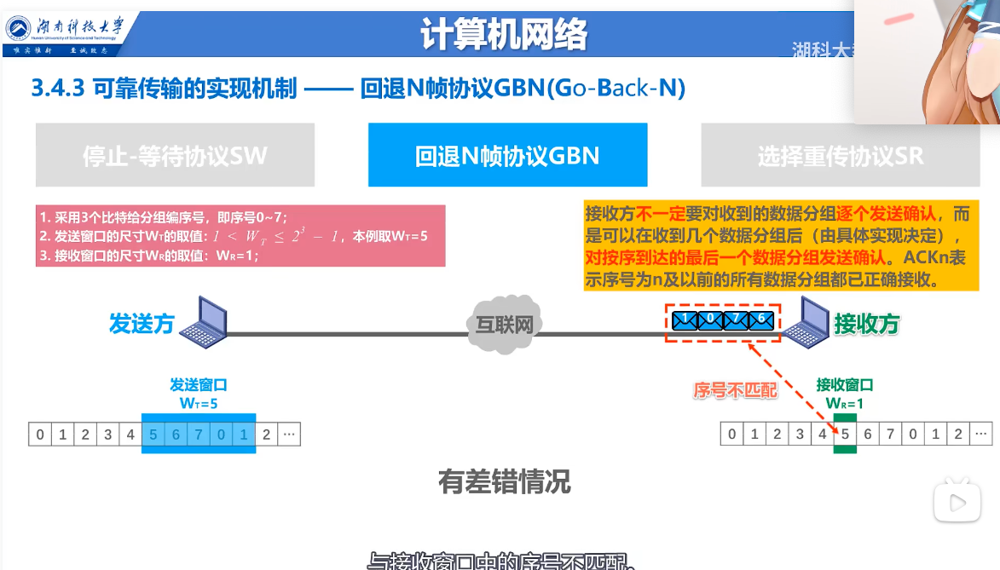
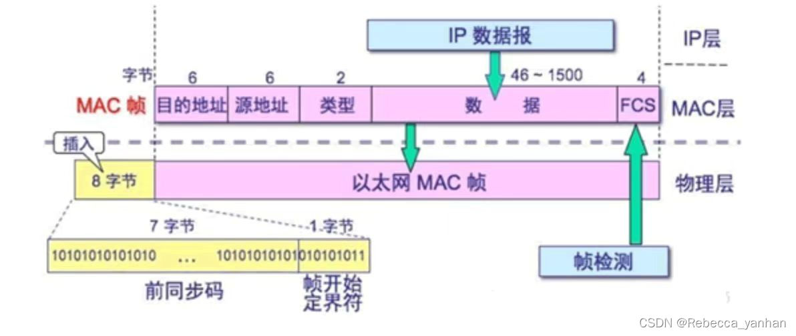
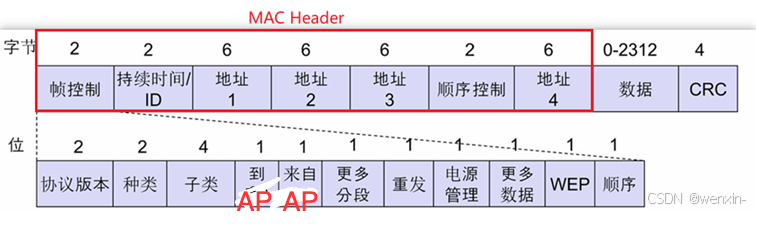
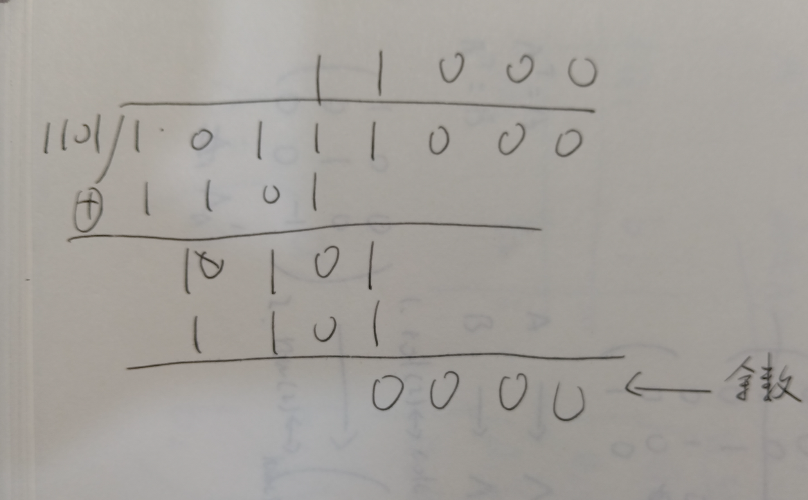
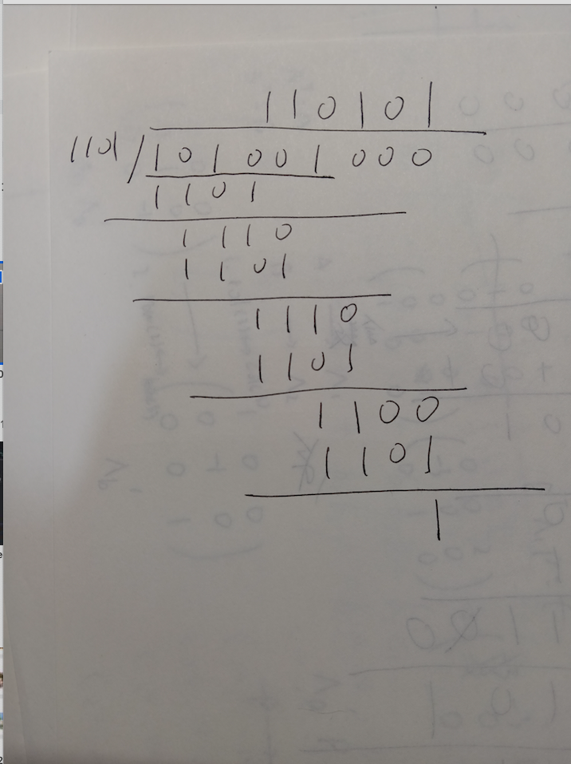
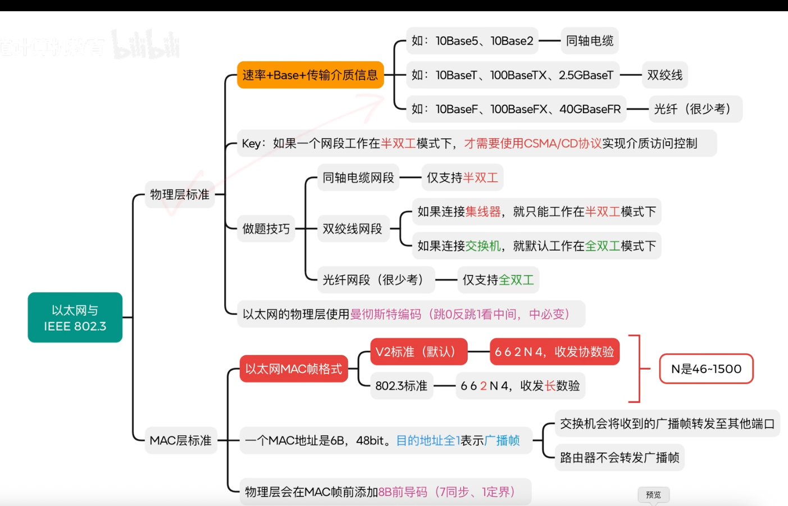
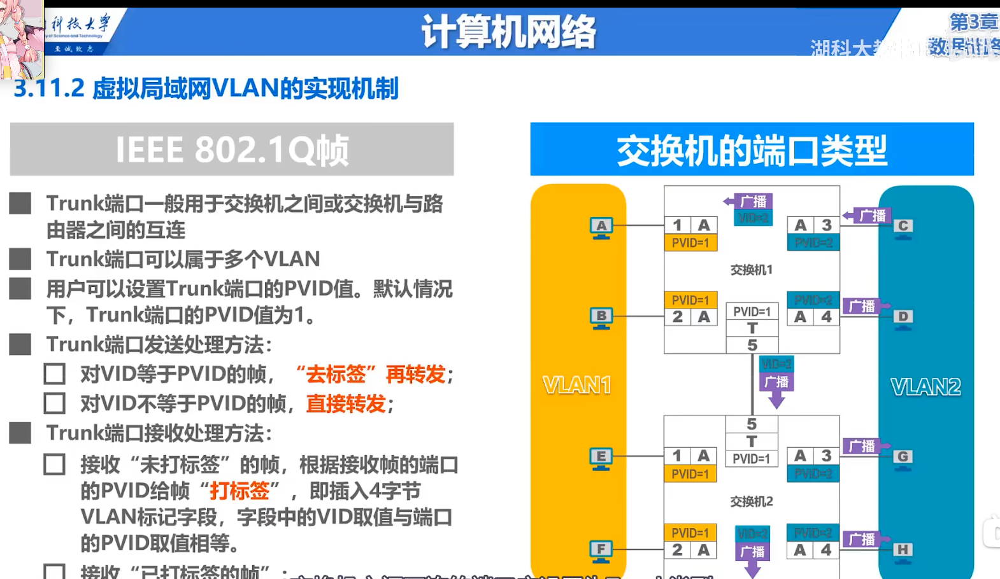

# 数据链路层



<!-- 




 -->

## 介绍

数据链路层 介于 网络层 与 物理层之间，网络层 就像是 一条路线的两端，而数据链路层就像是 路线中的各个站点  
我们知道网络层的IP数据报有差错检测，而数据链路帧也有差错检测，其实这不会冲突  
IP数据报的差错检测 对象是 发送方 和 接收方 两端，而数据链路帧的差错检测是 中转的各个站点之间

在整个网络数据传送途中，源IP地址和目的IP地址是不会变的，而源MAC地址和目的MAC地址可能会有多次变化  
网络层之间传输使用的是 IP数据帧，而数据链路层对IP数据帧包装成MAC帧，在各站点之间进行传输，层层转手

___

我们换成 货运公司 的视角，我们作为一个卡车司机，需要将我们的货物，也就是IP数据报传输到 目的地，但是我们有严格的8小时工作制，所以我们用 换人不换车 的方式，从一个站点送到另一个站点后，由这个站点的人进行 接力，并进行一系列交接事宜(差错检测) ，由这个站点的人将车开到下一个站点(下一个MAC地址)，直到运输到 接收端
___

我们重新整理下整个过程，假设我们是长途冷链运输公司 的司机，这一天公司接单一份单子

1. 接单/封装成帧  
公司接到单子，知道了 下一个站点的信息(连接信息) 和 交接仓库类型(连接类型) 后，还需要 检测 这批货物 是否合格，是否通过防疫标准(计算差错校验位)，检测合格后，将 **货物** 和 **合格证书** 一起装货
2. 组帧/装货  
接着，公司安排人手 将货物搬运到 **半挂卡车** 的拖车上(组帧)，由我们进行运输任务，将车开到下一个站点
3. 下一个站点，差错检测  
我们将半挂卡车开到下一个站点，进行交接和检查
    - 如果检查到有异常状况，原来的拖车会被直接销毁，我们将半挂开回去，重新再运一遍
    - 如果没有异常状况，由这个站点接收这个单子，并由这个站点的半挂车司机，将拖车带着其货物 运输到下一个站点  
    并且 我们告诉自己的公司，这批货物已经完成交接

在早期运输过程中，我们这些司机 都挤占在一条线路上，还要避免撞车，极其拥堵，详见 介质访问  
到了现在，都是使用专用通道，快速高效

本来公司是只有一位司机进行 运输任务，但是后来任务颇多，需要添加人手，组成一个车队去传输，虽然运输效率变高了，但是对方站点忙不过来，需要一点手段来实现 双方的可靠传输，从而避免 数据出错，详见可靠传输

## 接单/封装成帧

数据链路层 会将 来自网络层的IP数据报进行封装，在 **帧头** 有

1. 目的 MAC 地址
2. 源 MAC 地址
3. 类型  
这个类型是指要交给 网络层的哪个服务协议，可以是 IP协议，也可以是 地址解析协议

在 **帧尾** 会添上 差错控制 位，通常使用 CRC 进行计算



注意到，途中有个叫 前导码 的东西，其中包含了 7个字节的 前同步码 和 1个字节的帧开始定界符  
前同步码 是 1 和 0 相互交替，到了 帧开始定界符 都是 1 和 0 交替，最后突然变成 11，这 1 和 0 相互交替 是与目标节点的时钟相互同步，告诉目标后续有数据要发送，两边时钟协调一致后，马上传送 11，开始传送数据  
在我们这个比喻中，就像是 公司提醒 客户，我们已经装好货物，请及时查收
___

实际上，封装成帧 的细节会根据 有线网络 和 无线网络 的性质有稍许不同，具体表现在帧的结构上  
上面的例子中，我们讨论的是 有线网络 的帧结构

```rust
enum ServiceType {
    IPv4,
    IPv6,
    ARP,
    RARP
}

struct Frame {
    address_target_mac: [u8; 6], // MAC 地址有48位
    address_source_mac: [u8; 6],
    service_type: ServiceType,
    ip_datagram: IPDatagram,
    fcs: u32 // 4个字节，32位二进制数，也可以写 [u8; 4]
}
```

但在 **无线网络** 中，由于其信号衰减幅度极大，极容易收到干扰，帧的结构会更复杂一些  
为了最大程度的可靠传输，无线网络中有中转站的存在，就像中继器一样，可以接力传输到另一端  
无线网 帧的一部分扩展就是针对这个中转站，有字段

1. 中转站地址，这个放在 **地址一** 字段  
剩下的 源地址放在 地址二，目的地址放在 地址三
2. FromAP 位  
标识这个帧 是来自 中转AP 的
3. ToAP 位  
标识这个帧 是传给 中转AP 的



我们描述下关键结构

```rust
enum FrameType {
    Manage,
    Control,
    Data
}

enum FrameSubtype {
    Data,
    RequestToSend,
    ClearToSend,
    Acknowledge
}

struct FrameControl {
    frame_type: FrameType,
    subtype: FrameSubtype,
    from_ap: bool,
    to_ap: bool
}

struct Frame {
    frame_control: FrameControl,
    address_ap_mac: [u8; 6],
    address_source_mac: [u8; 6],
    address_target_mac: [u8; 6]
    ip_datagram: IPDatagram
}
```

有线以太网 数据链路层中，需要 一个站点一个站点的传递，也可以看成中转，无线网中，可以看出，中转之中，还有中转

## 装货/组帧

组帧，不如说是对帧的序列化，不是序列化成 JSON 格式，而是 二进制格式  
组帧发生在 发送方，而对应的拆帧 发生在 接收方，两方一个是 序列化，一个是 反序列化，用我们这个 运输公司的逻辑来说，一个是 装货，一个是 卸货  
在组帧的时候一定要确保数据不会出错，一旦出错，接收端 对帧进行反序列化时，得到的完全是错误的数据

在网络发展早期，工程师采用 **字符计数** 的方式来进行组帧，数据由

1. 数据个数
2. 数据

构成，假如一个帧中有数据 `1234` ，加上 数据个数，一共5个数据，那帧将以 `51234` 的形式传输  
我们发现，只要有一个数据出错，后续的数据接连出错，一步错，步步错，这种方法基本不用

后来，工程师们用类似如下的形式来序列化帧

```
begin
    1234
    5678
end
```

用一个特殊的数据表示 `begin` ，即传输开始  
用一个特殊的数据表示 `end` ，即传输结束  
但是我们很快发现一个问题，如果传输的数据中，有和 `begin` 或 `end` 同样格式的数据 该怎么办？  
我们又拿出一个特殊的数据 `esc` 表示 转义，比如在数据中有和 `begin` 或 `end` 相同格式的数据，我们这样序列化数据

```
begin
    esc begin
    esc end
end
```

那如果和 `esc` 相同呢？再加一个 esc

```
begin
    esc esc
end
```

在接收端，这种特殊数据不会作为数据进行处理，这种方式叫做 **首尾定界符法**

目前主流的方式有两个  
一是 **零比特填充法**，加工数据时，如果连续遇到5个1，那就在后面添加一个0  
二是 **违规编码法**，将 1 序列化成 高低电平，将 0 序列化成 低高电平，在接收时，如果发现有 高高电平 或是 低低电平，那就看作违规编码，不做其进行处理  
很明显，这种方法有强大的抗干扰能力，并且序列化方式极其简单

## 清点和交接/差错检测

差错检测 其实有两个阶段  
第一个阶段是 **发送端** 清点货物，确认货物质检合格，并将质检报告和货物一起运输
第二个阶段是 **接收端** 交接货物，再对货物进行一次质检，查看质检报告是否和 发送端 的质检报告相同

质检方式有很多种，我们只讲 奇偶校验，CRC 校验 和 带一定能力纠错的 海明码

### 奇偶校验码

这个方式专门对 1 的个数进行校验  
给定一份二进制数据，现在我们要进行 **奇校验** ，如果数据中1的个数是奇数，我们为数据附加一个0，如果有偶数个1，那我们为数据附加一个1  
如果要进行 **偶校验** ，如果数据中有奇数个1，那就添加一个1，如果有偶数个1，那就加一个0

这种方式的检错能力有限，如果有偶数个错误尝试，无法检出，也不能判断有多少个错误

### CRC 编码

CRC，循环冗余校验码，这个东西的生成需要依靠一个 生成多项式，假设双方 **约定** 生成多项式是
$$
G(x) = x^3 + x^2 + 1
$$
___
发送方要发送 数据 `10111`，他要进行

1. 构造被除数  
已知生成多项式 最高次项为 3，那就在原始数据后面添加 3 个0，构成被除数 `10111000`
2. 构造除数  
生成多项式的 次项系数 一一提取，得到 `1101`，将其作为除数
3. 计算余数/异或  
以往的除法都是用减法，这里我们用异或位运算
4. 拼接原始数据 和 余数，如果余数不够长，在前面填0，直到余数宽度和 生成多项式 的次项相同

我们举几个例子，假设我们要发送  **10111** ，我们需要

1. 构造被除数 为 **10111000**
2. 构造除数为 **1101**
3. 计算余数  
  
发现余数为0，填充，变为 **000**
4. 拼接原始数据和余数，得到 **10111000**

我们再发送 101001 试试

1. 构造被除数 为 **101001000**
2. 构造除数为 **1101**
3. 计算余数  
  
得到余数 1，填充，获得 **001**
4. 拼接原始数据和余数，得到 **101001001**

___
接收方收到数据后，他要进行

1. 构造被除数，这里用 接收到的数据 作为被除数
2. 构造除数，用生成多项式
3. 计算余数，如果余数为0，那就是说没有错误，非零表示有错误

接收方 接收到 **10111000** ，现在

1. 被除数是 **10111000**
2. 除数是 **1101**
3. 计算余数，得到0，说明数据没有出错

### 海明码


假设我们需要传输四位数据，$D_4D_3D_2D_1$  
我们用三位校验位 去校验这四位数据 $P_3P_2P_1$  
我们将 校验位，用位置的高低 排序成
$$
P_3P_2P_1
$$
既然有三位，我们用这三位来表示二进制数 $XXX$ ，其中

1. $P_1$ 表示 $XX1$
2. $P_2$ 表示 $X1X$
3. $P_3$ 表示 $1XX$

我们知道，校验位 不能去校验自身，那么我们

1. 用$P_1$ 去校验第 $5(101b), 7(111b), 3(011b)$ 位
2. 用$P_2$ 去校验第 $3(011b), 7(111b), 6(110b)$ 位
3. 用$P_3$ 去校验第 $5(101b), 6(110b), 7(111b)$ 位

并且我们将

1. $P_1$ 放到 第1位
2. $P_2$ 放到 第2位
3. $P_3$ 放到 第4位

重新排序 数据位 与 校验位
$$
D_4D_3D_2P_3D_1P_2P_1
$$

那又如何计算校验位呢？用异或
$$
\begin{aligned}
&P_1 = H(5) \oplus H(7) \oplus H(3)& \\
&P_2 = H(3) \oplus H(7) \oplus H(6)& \\
&P_3 = H(5) \oplus H(6) \oplus H(7)&
\end{aligned}
$$

___
现在我们对数据 **1010** 提供3个校验位，根据上述过程，我们加工数据，得出发送的数据为

|P(7)|P(6)|P(5)|P(4)|P(3)|P(2)|P(1)|
|:--:|:--:|:--:|:--:|:--:|:--:|:--:|
|D(4)|D(3)|D(2)|P(3)|D(1)|P(2)|P(1)|
|1|0|1|0|0|1|0|

倘若我们收到的数据是 **1110010** ，在这个数据中，第6个数据被篡改了，我们再次计算校验位  
得到

1. $P'(1) = 0$
2. $P'(2) = 0$
3. $P'(3) = 1$

将其分别与 接收数据中的校验位 异或，得到

1. $P'(1) \oplus P(1) = 0$
2. $P'(2) \oplus P(2) = 1$
3. $P'(3) \oplus P(3) = 1$

将其由索引从高到低排列，的到 $110b$，即十进制数6，由此我们发现第6位数据出现了问题，如果要纠错，直接给第6位取反即可

这种 $P' \oplus P$ 我们叫做校验子
___
上述过程中，我们发现，索引都是从1开始的，当 校验子全为0 时表示数据无错，如果不为0，他还有 $2^k-1$ 个取值，他要映射到海明码的所有数据，即 $1 \to n+k$ 的范围，映射范围不能少，只能多，或者刚好，由此有
$$
2^k - 1 \ge n + k
$$

## 运输过程/介质访问

[详见这里](./介质访问.md)

## 车队运输/可靠传输

由于运输时，司机只有我们一个人，需要我们一趟一趟跑，公司决定加派司机，这个时候需要 发送方 与 接收方 保持一定的通讯，从而使得 快速传输的同时，保证数据正确送达

在司机只有一个时，我们使用 **停止等待协议** 在双方之间通信，发送方需要我们这个司机回来，才会装载下一批货物  
倘若我们没有在规定时间内回来，我们的公司/发送方 会认为我们跑路了，会再找一位司机进行传输

公司后续会组建一个固定长度为 $4$ 的车队，车的编号从 $0$ 到 $4-1=3$  
下一个站点有点窘迫，他们的工作空间极其狭小，一次只能接收 **一辆车** 卸货，并且只能按顺序处理，乱序的车队他们无法处理  
当我们的车队按序，准时到达时


## 补充: 局域网





## 补充: 虚拟局域网


## 补充: 有线以太网MAC帧 的数据长度 和 无线MAC帧的 数据长度