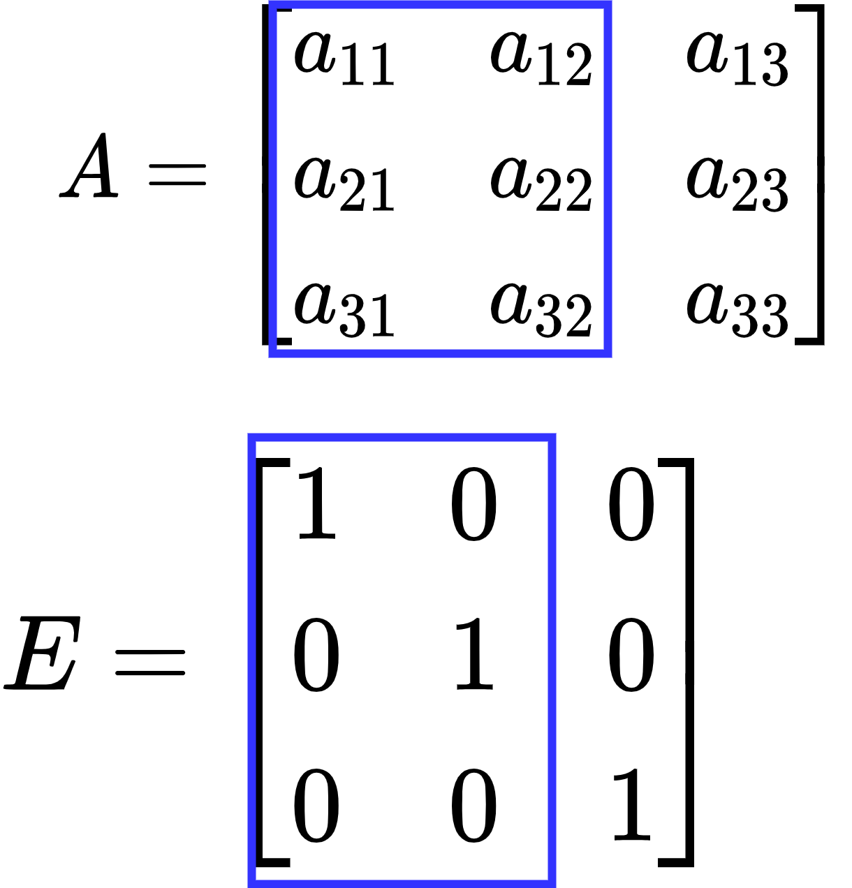
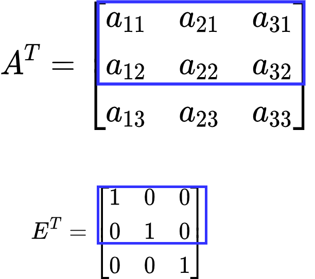

# 矩阵

在整理这个线性代数的时候，我们就已经知道，矩阵是用作映射 一个向量 到另一个向量 的工具，这我们已经在前面的章节做过大量探讨

然而在教材上，让人难懂是 **矩阵的秩** 这个内容，让人看的云里雾里的，这个章节要重点讲讲  
不过我们要先引入一些矩阵的变形

## 补充: 矩阵的变形

1. 转置矩阵 $A^T$  
将矩阵 $A$ 的行作为列，得到一个新矩阵
2. 逆矩阵 $A^{-1}$ 或 $rev(A)$  
我们已经直到，矩阵能够映射向量，有 $Av = u$ ，逆矩阵就是对这个过程的还原 $v = A^{-1}u$
3. 伴随矩阵  
这是在探讨矩阵用作线性方程组时，顺带求出的一个矩阵，他由一系列代数余子式构成，假设有矩阵 $A(m \times n)$ ，伴随矩阵记作
    $$
    A^* = \begin{bmatrix}
    A_{11} & A_{21} & \dots & A_{m1} \\
    A_{12} & A_{22} & \dots & A_{m2} \\
    \dots & \dots & \dots & \dots \\
    A_{1n} & A_{2n} & \dots & A_{mn}
    \end{bmatrix}
    $$

## 其他矩阵的性质

## 矩阵的秩

### 1. 初等变化后，矩阵的秩序

初等变化，有

1. 将某行/某列 乘 $k$ 倍，加到另一行/列上，其中 $k \ne 0$
2. 将某行/某列 单独乘 $k$ 倍，其中 $k \ne 0$
3. 将某行/某列 互换

并且初等变化完全可以用矩阵表示，在前面章节，我们已经直到，如果要对矩阵 $A$ 进行行变换，只需要用一个可逆的矩阵 $P$ ，并调用
$$
PA
$$

如果要进行列变换，只需要用一个可逆的矩阵 $Q$ ，并调用
$$
AQ
$$

并且行列变换也可以这样操作，如果有矩阵 $A(3 \times 3)$
$$
A = \begin{bmatrix}
a_{11} & a_{12} & a_{13} \\
a_{21} & a_{22} & a_{23} \\
a_{31} & a_{32} & a_{33}
\end{bmatrix}
$$

要交换第1行和第2行，我们对其左乘一个置换矩阵 $P$
$$
A' = PA
$$
其中
$$
P = \begin{bmatrix}
0 & 1 & 0 \\
1 & 0 & 0 \\
0 & 0 & 1
\end{bmatrix}
$$

这个 $P$ 也可以看作对单位矩阵进行 第1列和第2列 进行交换，
要交换矩阵 $A$ 的第1列和第2列，对 $A$ 右乘置换矩阵 $P$ 即可
$$
A' = AP
$$

回到正题，初等变化都是可逆变化，因此初等变化后的矩阵，**他的秩是不变的**

### 2. 逆矩阵的秩

对于矩阵 $A$ 有
$$
u = Av
$$
如果存在逆矩阵 $A^{-1}$ ，代表其映射操作是可逆的，那么逆矩阵的秩和矩阵**相等**

### 3. 转置矩阵的秩

在讨论这个问题之前，我们先用一个 比较完美的例子，来说明转置矩阵的秩

#### a. n-dimension 下 n个n维向量组 构成的矩阵

假如在 $\text{dimension} = 3 \times 3$ 的空间中有一个矩阵$A$，它由 $3$ 个 $\text{dimension=3}$ 的向量组构成
$$
\begin{aligned}
&A(3\times 3) = (v_1, v_2, v_3)& \\
&\text{length}(v_{i}) = 3& \\

&A = \begin{bmatrix}
a_{11} & a_{12} & a_{13} \\
a_{21} & a_{22} & a_{23} \\
a_{31} & a_{32} & a_{33}
\end{bmatrix}&

\end{aligned}
$$

他的行列式可以表示为
$$
det(A) = a_{11} \times det(\begin{bmatrix}
a_{22} & a_{23} \\
a_{32} & a_{33}
\end{bmatrix}) - a_{12} \times det(\begin{bmatrix}
a_{21} & a_{23} \\
a_{31} & a_{33}
\end{bmatrix}) + a_{13} \times det(\begin{bmatrix}
a_{21} & a_{22} \\
a_{31} & a_{32}
\end{bmatrix})
$$

将其转置，有
$$
A^T = \begin{bmatrix}
a_{11} & a_{21} & a_{31} \\
a_{12} & a_{22} & a_{32} \\
a_{13} & a_{23} & a_{33}
\end{bmatrix}
$$
其行列式记作
$$
det(A^T) = a_{11} \times det(\begin{bmatrix}
a_{22} & a_{32} \\
a_{23} & a_{33}
\end{bmatrix}) - a_{12} \times det(\begin{bmatrix}
a_{21} & a_{31} \\
a_{23} & a_{33}
\end{bmatrix}) + a_{13} \times det(\begin{bmatrix}
a_{21} & a_{31} \\
a_{22} & a_{32}
\end{bmatrix})
$$

比较 $det(A)$ 与 $det(A^T)$ ，可以看到余子式是一样的，对角线元素互换了一下，不影响，于是我们有
$$
det(A) = det(A^T)
$$

当 $det(A) \ne 0$ 时，我们可以可以通过初等变化求出 $A^{-1}$
$$
(A | E) \to (E|A^{-1})
$$
并且 $rank(A) = rank(A^{-1}) = rank(E)$  
而 $det(A) = det(A^T) \ne 0$，那我们也可以通过初等变化求出 $(A^{T})^{-1}$
$$
(A^T | E) \to (E | (A^{T})^{-1})
$$
此时
$$
rank(A^T) = rank((A^{T})^{-1}) = rank(E)
$$

#### b. n-dimension 下 n-1 个 n 维向量组

假设在 $\text{dimension} = 3 \times 3$ 的空间下，有矩阵 $B$ 由 2 个 $\text{dimension = 3}$ 的向量构成
$$
\begin{aligned}
&B(3 \times 2) = (v_1, v_2)& \\
&\text{length}(v_{i}) = 3& \\

&B = \begin{bmatrix}
a_{11} & a_{12} \\
a_{21} & a_{22} \\
a_{31} & a_{32}
\end{bmatrix}&
\end{aligned}
$$

这下我们不能计算其行列式了，该如何探讨 $rank(B)$ 与 $rank(B^T)$ 的关系呢？

在上面，我们已经知道，如果矩阵 $A(n \times n)$ 其行列式不为0，那么他可以通过初等变化求逆矩阵
$$
(A | E) \to (E | A^{-1})
$$
并且
$$
rank(A) = rank(E)
$$

我们回头看看矩阵 $B$ ，他完全可以看作将 $A$ 截取了一部分，对应的，单位矩阵 $E$ 也被截取了一部分  


此时 $rank(B) = rank(A) - 1 = 2$

将$B$转置后
$$
B^T = \begin{bmatrix}
a_{11} & a_{21} & a_{31} \\
a_{12} & a_{22} & a_{32}
\end{bmatrix}
$$

同样以截取的视角看待  


依然是 $rank(B^T) = rank(A^T) - 1 = rank(A) - 1 = rank(B)$

#### c. 结论

经过上述讨论，我们已经证明了
$$
rank(A) = rank(A^T)
$$

### 4. 矩阵组合 后的秩

矩阵，如果我们把他看作一个**矩形**  
那么两个矩阵可以拼接在一起时，有两种情况

1. 水平拼接 $(A | B)$
2. 垂直拼接 $\binom{A}{B}$

假设拼接后的矩阵秩为 $r$  
我们先用**横着**看，用**矩形** 去画这种 水平拼接的矩阵  


对于**行秩**  
在 $rank(A) \ge rank(B)$ 时，有 $r \ge rank(A)$  
在 $rank(B) \ge rank(A)$ 时，有 $r \ge rank(B)$  
统一一下形式，我们有
$$
r \ge max(rank(A), rank(B))
$$

再**竖着**看，若
$$
\begin{aligned}
&A = (a_1, a_2, \dots, a_m)& \\
&B = (b_1, b_2, \dots, b_n)&
\end{aligned}
$$

对于矩阵$B$ 来说，如果
$$
b_{i} \notin span(A)
$$

从**列秩**来看，就有
$$
r = rank(A) + rank(B)
$$
如果存在
$$
b_{i} \in span(A)
$$
就有
$$
r < rank(A) + rank(B)
$$

统一一下形式，就有
$$
r \le rank(A) + rank(B)
$$

而行秩和列秩 相等，前面我们已经推导过了，所以
$$
max(rank(A), rank(B)) \le r \le rank(A) + rank(B)
$$

依次类推，垂直拼接后的矩阵也能得到上述结论

### 5. 矩阵结合 后的秩

#### a. 与其他矩阵相乘

对于结合矩阵 $AB$ ，在其映射向量时，我们画出这一个过程  


向量被矩阵映射时，有可能映射到零空间，也就是秩会有损失，因此
$$
\begin{cases}
rank(AB) \le rank(B) \\
rank(AB) \le rank(A)
\end{cases}
$$

统一形式，得到
$$
rank(AB) \le min(rank(A), rank(B))
$$

#### b. 与自身转置相乘

在矩阵映射的过程中，如果有矩阵 $A(m \times n, \text{rank=r})$ ，对向量 $v(n \times 1)$ 映射后，得到的结果，肯定有

```julia
count(!iszero, A*v) == r
```


再经过 $A^T$ 映射后，还是有

```julia
count(!iszero, transform(A) * A * v) == r # r(transform(A)) == r(A)
```

由此，我们得到
$$
r(A) = r(A^TA)
$$

而
$$
r(A) = r(A^T)
$$

又可以得到
$$
r(A^TA) = r(AA^T)
$$

结合起来，我们有
$$
r(A) = r(A^T) = r(A^TA) = r(AA^T)
$$
