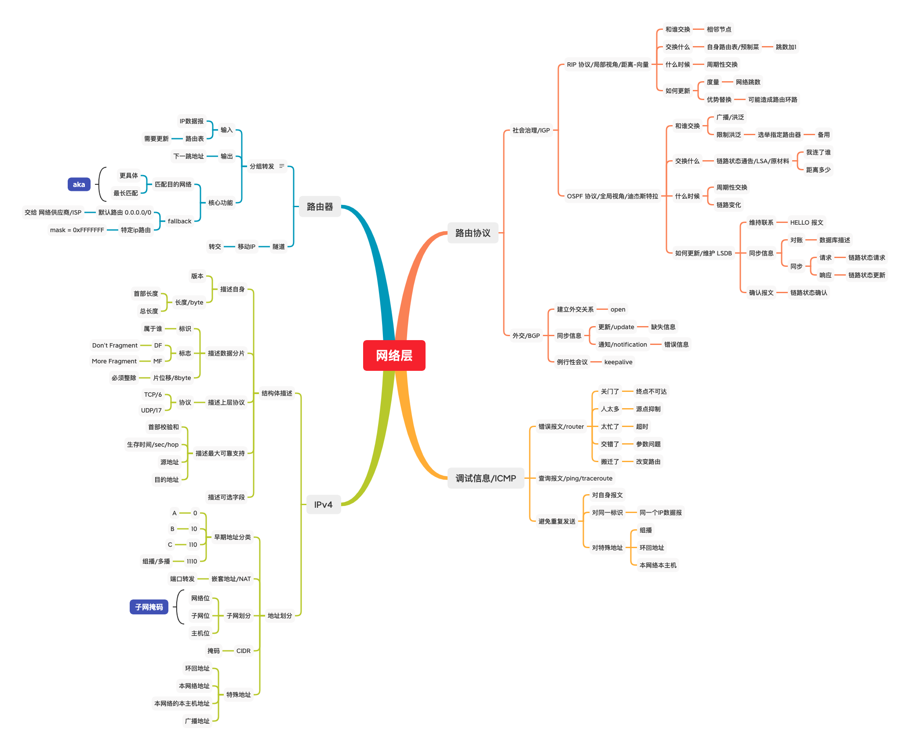
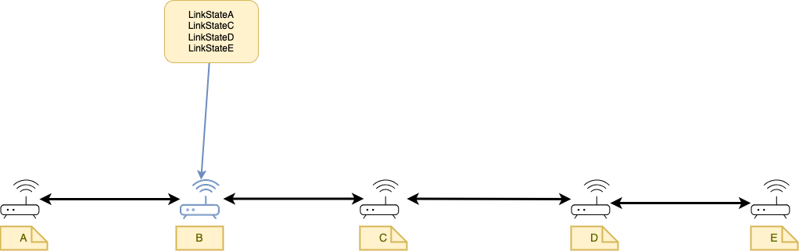
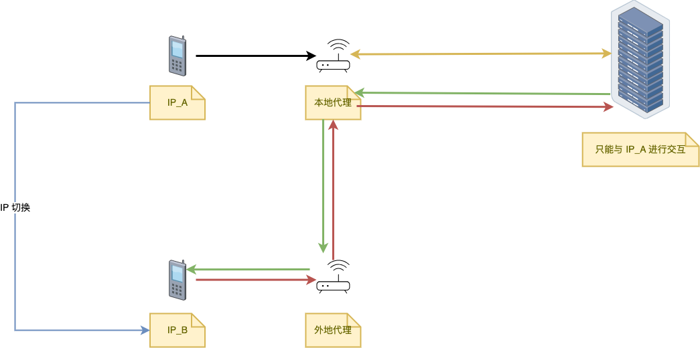
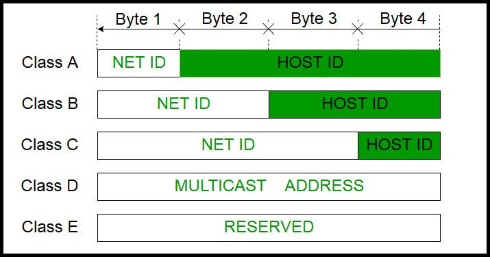

# 网络层



网络层要解决什么问题?  
网络层就像是导航软件，你需要提供 出发地点 (源IP地址) 和 目的地点 (目标IP地址)，导航会在两者之间计算出一条最优路径(路由)

至此，我们引出了网络层中两个最重要的东西 -- IP地址 和 路由  

- IP 地址是为了解决 目的地在哪
- 路由 是为了解决 怎么到达 目的地

## 路由器与路由协议/一个国家内的社会治理/IGP

说起网络，我们都会想到路由器这个东西  
路由器，我们可以把他看作 网络洪流中的一个节点，整个互联网由 无数个路由器节点 组成，从而实现互联互通  

这个节点不仅需要代理我们设备(手机，电脑)的上网请求，还需要将洪流中 传输的IP数据报进行转发  
于是，我们引出了路由器的一个重要功能 --- **分组转发**

### 分组转发

分组转发 可以对网络中其它节点传递的IP数据报进行转发，也可以对自己治下的设备生成的IP数据报进行转发

```rust
fn router_forwarding(input: IPDatagram) -> NextHop
```

但是路由器根据什么来确定 下一条的地址呢？是 路由表，路由表记录了

1. 目的网络 with 子网掩码
2. 下一跳地址

那我们调整下对 分组转发 的描述

```rust
fn router_forwarding(input: IPDatagram, state: RoutingTable) -> NextHop
```

给定一个输入的 IP 数据报，其结构大致为

```json
datagrame {
    ip_address
}
```

而此时的路由表的某一项为

```
target_network/mask  next_hop
```

只有当 `ip_address & mask == target_network` ，才算匹配，此时路由器将该分组转发给 `next_hop`

如果遍历完路由表，都没有匹配的项呢？总不能数据报到这就卡住了，不继续转发了吧？这会让网络觉得我这的路径出了问题，调整全网的路由表，把我屏蔽了  
工程师们为了防止这种情况，特地设置了一个 `fallback` 规则，在路由表最后一项设置了一个默认路由

```
0.0.0.0/0 
```

当 `ip_address & 0` 时，不管 `ip_address` 长什么样，与0相与都会变成0，于是与默认路由匹配，此时路由器，或者说网络供应商的路由器，会将该分组转给 相邻的网络供应商的路由器  
这跟我们现实中的，这道题我不会，你问问别人，异曲同工

### 路由选择

刚刚探讨了如何使用路由表进行路由匹配，但是路由表该如何生成呢？

早期的网络规模不大，大家都采用 **静态路由**，即把路由表写死，找不到路由匹配项的话，那可能直接歇菜了

网络规模一大，大家这个时候都是用自动化的思维，让路由器自己去调整路由表，即 **动态路由**  
而不同的动态路由协议 需要回答这四个问题

1. 和谁交换信息
2. 交换什么信息
3. 什么时候交换
4. 交换完毕后，如何更新自身路由表

#### a. 距离-向量协议/RIP


距离-向量协议 用 网络之间的跳数 作为评价标准，他这样回答了上述问题

1. 他与相邻节点交换信息
2. 相邻节点之间 交换 其 **自身路由表**
3. 周期性交换，大概30sec 一次
4. 交换完毕后，先将其它节点的路由表的跳数都自增一遍(因为经过自身节点也算一跳)，再与自身路由表进行比较，在匹配路由表项中，哪个有优势，就采用哪个路由表项

距离-向量协议 虽然收敛速度快，但是不准确，如果有错误信息，会导致更新多次才能正确收敛

#### b. 链路状态协议/OSPF



链路状态路由协议 使用 网络延迟 或 其它标准来评价网络质量，他这样回答上述问题

1. 他向网络中的所有节点交换信息
2. 相邻节点之间 交换 其链路状态，即我连接了哪些网络，代价是多少
3. 周期性交换 和 链路状态变化 时都会触发更新
4. 所有路由器都维护了一个 LSDB ，即链路状态数据库，同步数据完成后，每个路由器 都用 **迪杰斯特拉** 算法算一遍最短路径，从而得到路由表

现在我们对一些细节做一些补充说明

既然这个协议对 所有节点交换信息，那么他需要通过 广播洪泛得像其它节点交换自身链路状态  
但为了防止广播风暴，协议中可以指定一个 **选举指定路由器** 和 **备用选举指定路由器** 来让其它节点访问获取 网络中的链路状态

各个节点需要维护同一个LSDB，他使用以下报文来维护数据库

1. 维持连接  
    定期发送 **HELLO 报文**
2. 同步信息
    - 对账时，发送 **数据库描述报文**
    - 对账发现，有数据缺失或错误时，请求方发送 **链路状态请求报文**，对方发送 **链路状态更新报文**
3. 同步完成后，告诉对方已确认同步，发送 **链路状态确认报文**

#### 功能描述

至此，我们讨论完了 **路由选择** 的功能  
我们描述 RIP 协议

```rust
fn routing_rip(other_tables: Vec<RoutingTable>) -> RoutingTable
```

我们描述 OSPF 协议

```rust
fn routing_ospf(link_states: Vec<LinkState>) -> RoutingTable
```

## 自治系统与路由协议/国家之间的相互交流/BGP

有些网络处于自身原因或者其他原因，不会都采用同一种路由协议，这时候我们把这个网络叫做 自治系统，这算是屏蔽了底层细节，做了一层抽象  

其实我们上面的章节讲的是 同一网络内 的路由协议，这就好像在一个国家内进行社会治理，而自治系统间的路由协议，就好像是 国与国 的外交程序  
国与国之间的交流，就不能是简单的计算 图的最短路径了，拿日本东京举例，他的领空属于美国，每个飞机经过的时候都要绕一大圈

BGP 有如下报文，我们用外交的视角来看

1. OPEN 报文  
    建立外交关系
2. 同步信息
    - 更新/Update 报文
    告诉对方，我今天的货币汇率是多少
    - 通知/Notification 报文，发送检测到的差错
    本国有人把二踢脚 发射到 对面，已经被逮捕，叫我们来处理一下
3. 保活/Keepalive 报文  
    定期问问对方，还活着吗，是不是亡国了

## 移动IP

我们看一个服务器与客户端交互的例子  
在服务器中

```python
(client_ip, client_port) = server.accept()

while True:
    send/recv data via (client_ip, client_port)
```

如果当前客户端IP发生了变化，服务端是找不到客户端的  
有什么方法能解决这个问题吗？
假设我在浙江这边，边走路边打王者(虽然这个我完全不会)，此时是浙江电信的运营商帮我代理网络请求，我的IP是 `IP_A`  
走着走着到福建了，此时是福建电信的运营商帮我代理网络请求，我的IP变成了福建的，为 `IP_B`

为了不坑队友，福建这边的运营商/**外地代理** 告诉 浙江的运营商/**本地代理** --- 你那边如果有 **目的地址** 为 `IP_A` 的数据的话，通过隧道转发给我，我来传给那个叼毛  
同样的，福建这边的运营商会把 **源IP** 为 `IP_B` 的网络请求，通过隧道转发给 浙江这边的运营商，浙江这边的运营商会将网络请求 发给 服务器，继续交互

过程可以看下图


**补充**
隧道技术，就是 将一个IP数据报看作数据，封装到有一个IP数据报中

## IP 地址

IP 地址，即指明了在网络的哪个位置中

### 地址划分

#### a. 早期地址划分

在网络发展早期，工程师们是这样对IP地址进行分类的



其中常用的是 A, B, C 三个分类，D 是多播地址(后续会谈到)，E 指的是 `Experiment` ，表示实验地址，保留不用

如何知道地址种类呢，我们用固定的前缀来区分，比如说

1. A 类地址 固定前缀 `0`
2. B 类地址 固定前缀 `10`
3. C 类地址 固定前缀 `110`
4. D 类地址 固定前缀 `1110`
5. E 类地址 固定前缀 `1111`

#### b. 地址的分配问题 和 改进

如果我要申请一个A类地址，主机号上最多可以分配给 $2^{24} - 2$ 个主机，但是我其实不需要那么多主机，大概就是最大的百分之一左右  
浪费了这么多钱，还用不满我这地址，我还不如去租一个呢

IPv4 中针对这种浪费问题有两种方法，都是建立在 **租** 这个概念上的，我们以开公司为例

我们租了一栋大楼的某一层用作办公，这栋楼的 **网络IP地址(主机号全为0)** 为 `192.168.0.0/16` ，可以分配 $65536 - 2$ IP地址  
我们的办公区在 3 楼，其中  

1. 一楼的网络IP地址为 `192.168.1.0/24` ，可以容纳 254 个人
2. 二楼的网络IP地址为 `192.168.2.0/24` ，可以容纳 254 个人
3. 三楼的网络IP地址为 `192.168.3.0/24` ，可以容纳 254 个人

我们打算从主机位中拿两位出来进行再分配，那么 主机号 就有 6 位，去掉广播地址，每个子网就有 62 个地址(网络位是0，算过了跟没算一样)

- 我们分配给 **财务部** 的房间为 `192.168.3.0/26`，IP地址从 `192.168.3.1/26` 到 `192.168.3.62/26`，广播地址为 `192.168.3.63/26`
- 我们分配个 **研发部** 的房间为 `192.168.3.64/26`，IP地址从 `192.168.3.65/26` 到 `192.168.3.126/26`，广播地址 `192.168.3.127/26`
- 我们分配给 **测试部** 的房间为 `192.168.3.128/26`，IP地址从 `192.168.3.129/26` 到 `192.168.3.190/26`，广播地址为 `192.168.191/26`

这就是简单的 **子网分配**，那么问题来了，研发部的一位员工买了个快递，快递员该如何交给他呢？  
快递员只用交给 **大楼前台** 就行了，大楼前台看到 有个给3楼 的快递，交到 **3楼前台**，3楼前台看到这有个研发部 的快递，交给 **研发部的前台**，最终由研发部的前台交给 研发部的那位员工  
大家也看出来，这种嵌套的IP地址，也就是这个前台，叫做NAT

谈到子网划分，不得不提的就是 CIDR(无分类子网划分) ，就是说他舍弃了 传统的 ABC 这种网络分类，管你这个那个的，直接进行分类

#### c. 特殊地址

在 IP协议 中有几种特殊地址，一是代表本网络的IP地址，即主机位全为0的地址，而是本网络的广播地址，即主机位全为1的地址

再是RFC协议规定的特殊地址，用于本地环回地址，`127.0.0.0/8`  
我们最常用的是 `127.0.0.1` ，也可以表示自身 `localhost`  
也可以用 `127.0.0.x` 表示同一台机器上的不同服务

### 结构体描述

我们来说明一下 IPv4 的数据报都描述了什么

#### a. 描述自身结构

1. 版本信息
2. 首部长度
3. 总长度

他首先描述了自身的 **版本信息**，表示是 IPv4 还是 IPv6  
再是长度信息，以 byte 为单位，其中有 **首部长度** 和 **总长度**

类似 TCP 报文，IP数据报 首部中有固定长度 20Byte，并且长度单位和TCP报文中描述首部长度的 *数据偏移* 一样，都是4Byte
出了固定长度，IP数据报 也可以自己添加选项字段  

我们知道，首部长度的单位为 32位，即4Byte  
当首部位固定长度 20Byte时，4位首部长度 字段值为 5(1001b)  
4位首部长度 字段值 最大为 15(1111b)，此时首部长度为 60Byte

#### b. 描述数据分片信息

1. 片位移
2. DF
3. MF
4. 标识

受到数据链路层的限制，IP协议中规定了最大数据单元MDU，倘若数据过长(包括首部长度)，就要进行分片，我们先看看分片过程


假设 MDU 是 1000Byte，而我们要传输 2500Byte 长度的数据，此时需要进行数据分片，并且遵循以下规则

1. 数据报 总长度 (首部 和 数据长度) 不能超过 MDU
2. 用片位移 记录 **数据部分** 在原来的位置
3. **片位移** 不同于长度，他以 8byte 为单位，所以需要确保他的值能被8整除
4. 使用 DF(Don't Fragment) 标志位 表示是否 不要切片
5. 使用 MF(More Fragment) 标志位 表示是否还有更多切片，在 `DF = 0` 时才有效
6. 考虑到 需要接受多个IP数据报的切片，需要用 **标识** (signature) 来标识这个切片身份，以便后续组合在一起，避免数据出错

## 改进分组转发 -- ICMP

我们重新看看 路由器的 **分组转发** 功能描述

```rust
fn router_forwarding(input: IPDatagram, state: RoutingTable) -> NextHop
```

我们没有考虑到一个问题，如果 分组转发 出错了怎么办？  
我们已经用 fallback 的默认路由 解决了 路由表找不到 匹配项的问题  
但如何解决 网络节点 故障的问题呢？  
要知道这是 各个独立的网络节点，没有像C语言中的 **errno** 全局错误码，也没有像 Java 中的 **Throwable** ，你不知道要抛给谁  
参考 Rust 语言的错误处理，我们用 **Result<T, E>** 重新描述 **分组转发** 功能

```rust
fn router_forwarding(input: IPDatagram, state: RoutingTable) -> Result<NextHop, ICMP::Error>
```

这其中的错误信息(ICMP错误信息) 可能是

1. 重点不可达 -- 关门了
2. 源点抑制 -- 人太多，处理不过来
3. 超时 -- 被其他事务纠缠，处理不过来
4. 参数问题 -- 提交参数 出错
5. 改变路由 -- 店面搬迁

这样，我们就知道了分组转发过程中 的错误信息

**注意**  
为了避免 重复发送 ICMP 错误报文，我们规定

1. 不能对 同一 **标识** 的数据报 重复发送 ICMP 错误报文
2. 对特殊地址，比如 组播，环回地址，本网络本主机 地址，不发送 ICMP 错误报文
3. 对 ICMP 报文，不进行 继续转发 关于 ICMP报文 的 ICMP报文
