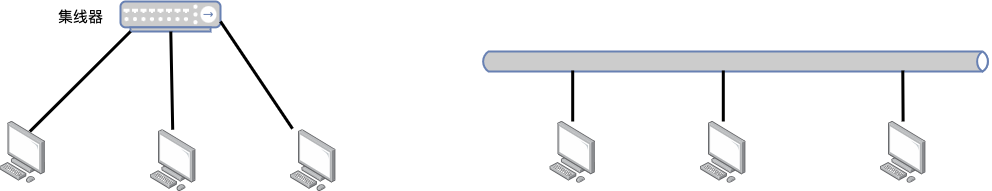
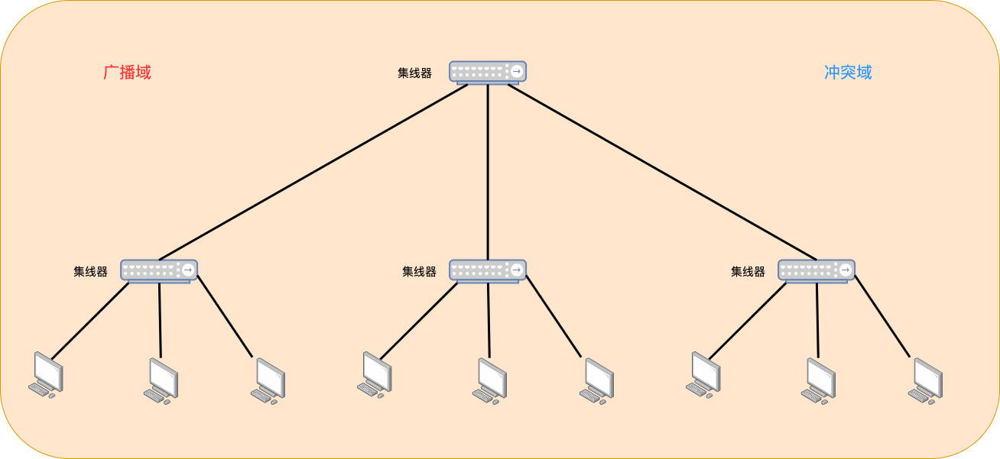
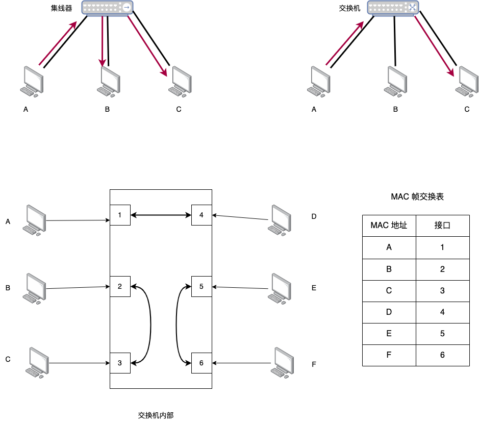
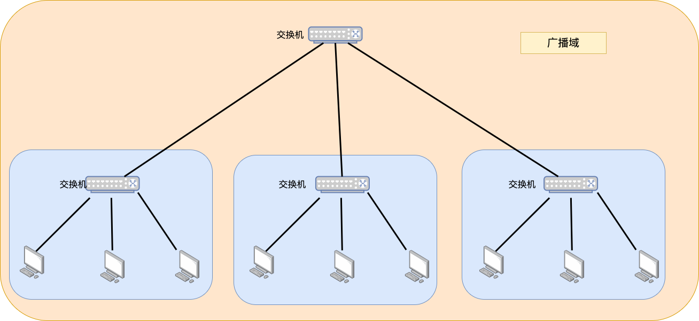
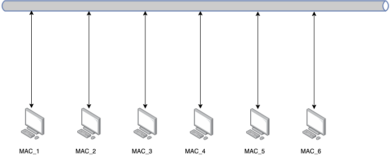
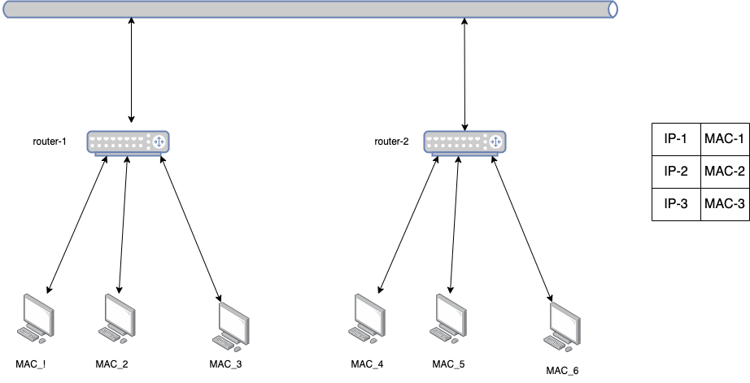
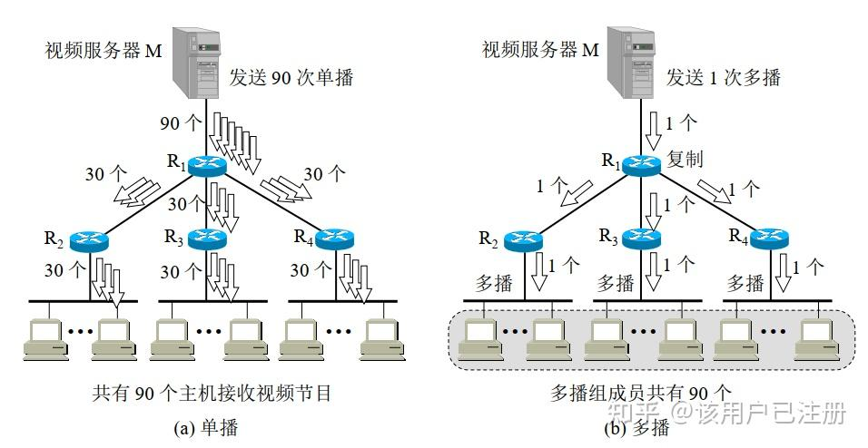

# 网络层协议补充

## 补充: 冲突域 与 广播域

冲突域，指的是 单播时，谁会与这次单播冲突  
广播域，指的是 广播时，谁会收到这次广播  

说到冲突域，不得不提的就是 集线器 设备

这个设备本质上 是个总线型设备，只要有一个设备 想发数据，整条总线上都会有数据冲突，冲突域 和 广播域 是一致的
当我们用 集线器 将几个网络连在一起的时候

由于总线性质，扩大后的网络，冲突域也会扩大，广播域也会扩大
___
后续，工程师们 开发了 更智能的 交换机，我们来简单看看交换机如何工作

设备A向设备D 发送和交换数据时，交换机 会将两者的数据通过 接口1 和 接口4 之间传输，冲突域被限制在了 接口1 和 接口4 之间的通路  
如果用交换机将多个网络连在一起

冲突域 被控制在交换机治下，广播域 扩展到整个网络

## 补充: 局域网中的信息交付 --- ARP 协议

倘若世界上的所有设备 都通过一条总线进行连接，此时没有IP地址的概念，只能通过其硬件地址(MAC)进行寻址  

在引入了 路由器 之后，网络结构随之一变

各个设备之间通过 IP地址 进行交互，但最后还是要通过 MAC 地址进行交互  
这种 IP地址对 MAC地址的映射，我们通过ARP协议完成，这是一种自学习模式的协议，在开始阶段需要广播，有了记忆后就可以直接单播交付  

需要注意的是，ARP 协议不一定只在路由器中工作，局域网中数据交付时，局域网内的设备也支持ARP协议

## 补充: 多播/简单了解即可

如果一个主播正在直播，房间里有2000人，如果是传统的路由器承担分组转发，直播平台每次要给2000个IP地址发送信息，这极其加大的服务器的负担  
从上图可以看到，支持多播协议的路由器 承担分组转发时，他只需要从服务器接受一份数据，并复制数据给治下的支持多播协议的路由器即可
___
IPv4(32位)规定多播地址 从 `1110` 开始，后续的地址 随意  
IPv4 既然规定了多播地址，MAC 上也有专用于多播的 **多播MAC地址** ，我们规定MAC(48位) **开头25位** 为 `01-00-5E` 时，作为多播MAC地址

$$
0000 \phantom{0} 0001 \phantom{0} 0000 \phantom{0} 0000 \phantom{0} 0101 \phantom{0} 1110 \phantom{0} 0
$$

此时MAC地址还剩下 23 位  
注意到 需要将IP多播地址中的 28位 映射到 23位剩余MAC地址，可能会出现映射重复的现象，即 不同的多播地址映射到相同的 多播MAC地址，此时需要  

1. 数据链路层 匹配 多播 MAC 地址
2. 网络层 匹配 多播 IP 地址

要走两趟，才能正确匹配